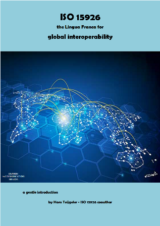
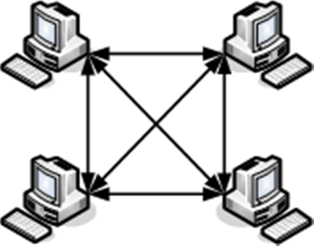
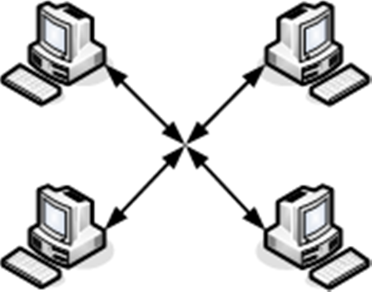

                https://15926.org/topics/                          

      

### Table of Contents

[TOC]

## **INTRODUCTION ВВЕДЕНИЕ**

Ever heard of medical systems that cannot exchange information? And systems of police, fire fighters, and ambulances not being able to exchange information?

Вы когда-нибудь слышали о медицинских системах, которые не могут обмениваться информацией? А  о системах полиции, пожарных и машин скорой помощи, которые не могут обмениваться информацией?

The process industries have that same problem. During the life cycle of any process plant, from conceptual design, via engineering and construction, to operations and maintenance, during the decades that a plant exists, information between the disciplines of all parties involved has to be exchanged. That used to be a problem and it still is.

В перерабатывающей промышленности та же проблема. В течение жизненного цикла любого технологического предприятия, от концептуального проектирования, инженерного проектирования и конструирования до эксплуатации и технического обслуживания, в течение десятилетий существования завода необходимо обмениваться информацией между дисциплинами всех участвующих сторон. Раньше это было проблемой, и это все еще есть.

In 1991 the European Union launched an ESPRIT project called ProcessBase with the task to develop a data model for life-cycle information. From there on representatives of plant owners, EPC contractors and equipment manufacturers kept developing that model. It reached ISO Standard status in 2003. Also other 'parts' of that standard ISO 15926 have been developed.

В 1991 году Европейский Союз запустил проект ESPRIT под названием ProcessBase с целью разработки *модели данных* для информации о жизненном цикле. Отныне представители владельцев заводов, подрядчики EPC и производители оборудования продолжили разработку этой модели. Он достиг статуса стандарта ISO в 2003 году. Также были разработаны другие «части» этого стандарта ISO 15926.

The parts that will be explained in this paper are:

·     Part 2 – Data Model

·     Part 4 – Reference Data

·     Part 7 – Templates

·     Part 8 – Implementation in RDF

·     Part 9 – Triple Store (still in development)

·     Part 10 - Conformance Testing (still in development)

Части, которые будут объяснены в этой статье:

• Часть 2 – Модель данных

• Часть 4 – Справочные данные

• Часть 7 – Шаблоны

• Часть 8 – Реализация в RDF

• Часть 9 – Triple Store – хранилище триплетов (все еще в разработке)

• Часть 10 – Проверка соответствия (все еще в разработке)

There are other parts, but these are not in the scope of this paper.

Есть и другие части, но они не входят в сферу этой статьи.

The overall title of ISO 15926 is:

Общее название ISO 15926:

 

Figure 1 – Title of ISO 15926 Рисунок 1 - Название ISO 15926

This integration of life-cycle information is doРисунок 1 - Название ISO 15926able for a software supplier, but to do that on a global scale and for all software that is used in the process industries appeared to be a task of Herculean proportions. It took us nearly 30 years to master that task. 

Эта интеграция информации жизненного цикла выполнима для поставщика программного обеспечения, но сделать это в глобальном масштабе и для всего программного обеспечения, которое используется в обрабатывающих отраслях промышленности, оказалось задачей геркулесовых пропорций. Нам потребовалось почти 30 лет, чтобы справиться с этой задачей.

It is now up to the plant owner/operators to take the lead in the application of ISO 15926.

Теперь владелец / операторы завода должны взять на себя инициативу в применении ISO 15926.

 

## **WHY ISO 15926 ПОЧЕМУ ISO 15926?**

In today's world we often see that people from all over the world can communicate in meetings and on the Internet. This is possible despite the fact that many of them speak another language back home. In those meetings and on the Internet they use a common language, be it English, Spanish, Chinese, or any other major language.

В современном мире мы часто видим, что люди со всего мира могут общаться на собраниях и в Интернете. Это возможно, несмотря на то, что многие из них говорят дома на другом языке. На этих встречах и в Интернете они используют общий язык, будь то английский, испанский, китайский или любой другой основной язык.

Computer systems also speak their own language internally, and as such can only communicate with other systems by means of interfaces. The number of interfaces grows exponentially with the number of systems. If you have two systems you have two interfaces. But if you have ten systems you already have, as a maximum, 90 interfaces.

Компьютерные системы также говорят на своем собственном внутренним языке и как таковые могут общаться с другими системами только через интерфейсы. Количество интерфейсов растет экспоненциально с количеством систем. Если у вас две системы, у вас есть два интерфейса. Но если у вас есть десять систем, у вас уже есть максимум 90 интерфейсов.

 

Figure 2 - Point-to-point interfaces Рисунок 2 - Двухточечные интерфейсы

This is, at present, the common situation. The cost for setting up and maintaining all these interfaces account for a substantial part of all IT costs.

В настоящее время это обычная ситуация. Затраты на настройку и обслуживание всех этих интерфейсов составляют значительную часть всех затрат на ИТ.

Through the years this problem hasn't been solved. Sure, we see an abundance of interface tools, but they don't really help to solve that problem, because they keep being, for the most, application-to-application or an 'island of automation'.

На протяжении многих лет эта проблема не была решена. Конечно, мы видим множество интерфейсных инструментов, но они на самом деле не помогают решить эту проблему, потому что они, по большей части, являются приложением к приложению или «островком автоматизации».

So, the solution is that we teach all our systems one common language.

 Таким образом, решение состоит в том, чтобы учить все наши системы одному общему языку.



Figure 3 - One interface only via a hub  Рисунок 3 - Один интерфейс только через концентратор

This language can be anything, if there wouldn't be more requirements.

Этот язык может быть чем угодно, если бы не было больше требований.

However, the goal of integrating life-cycle information for the facilities meant that we had to cope with the following problems:

·     the number of different application programs is very large;

·     the terminology for the various phases in that life cycle are widely different;

·     we need a stable standard that will be there for decades.

 Однако цель интеграции информации о жизненном цикле для объектов означала, что нам пришлось решать следующие проблемы:

• количество различных прикладных программ очень велико;

• терминология для различных фаз в этом жизненном цикле сильно различается;

• нам нужен стабильный стандарт, который будет существовать десятилетиями.

In this paper the ISO 15926 solutions to these problems are covered.

В этом документе ISO 15926 рассматриваются решения этих проблем.


## **ISO 15926 AND THE SEMANTIC WEB ISO 15926 И СЕМАНТИЧЕСКАЯ СЕТЬ**

Let us peek into the end result as a kind of sign post:

Давайте посмотрим на конечный результат в виде своего рода положений:

·     all things, that 'own' data, are 'declared', so typed and identified, and are on the internet (with due security measures in place) ;

• все, что является «собственными» данными, «объявляется», типизируется и идентифицируется, а также находится в Интернете (с соблюдением надлежащих мер безопасности);

·     all relationships are, one by one (for the most), turned into things that are typed and identified; these things are called 'templates' ;

• все отношения, один за другим (для большинства), превращаются в сущности (things), которые типизированы и идентифицированы; эти сущности называются «шаблонами»;

·     all technical and operational information of a facility can be mapped to templates, with a so-called 'effective date-time' and, when required, other meta data such as status, access rights, etc. ; 

• вся техническая и эксплуатационная информация объекта может быть сопоставлена с шаблонами с так называемой «действующей датой-временем» и, при необходимости, другими метаданными, такими как статус, права доступа и т. д.;

·     the basis for the integration of this information are functional diagrams such as P&IDs, that provide the topological data ;

• основой для интеграции этой информации являются функциональные диаграммы, такие как P&ID, которые предоставляют топологические данные;

·     all information is turned into RDF [N-triples](https://www.w3.org/TR/n-triples/) and stored in [triple stores](https://en.wikipedia.org/wiki/Triplestore) ;

• вся информация превращается в N-триплеты RDF и хранится в хранилищах триплетов (Triple Store);

·     each triple is a set of three internet addresses that are subsequently for: 

• каждый триплет представляет собой набор из трех интернет-адресов, которые впоследствии предназначены для:

\-  'subject' (the thing about which the triple gives information) ;

\- «субъект» (сущность, о которой триплет дает информацию);

\-  'predicate' (the relation) ;

\- «предикат» (отношение);

\-  'object' (the thing the predicate points at) ;

\- «объект» (сущность, на которую указывает предикат);

   		e.g. Vessel V-145  hasAsPart Nozzle N3  ;

 			например, Судно V-145 имеет патрубок сопла N3;

·     each template forms an encapsulated set of triples, representing data and meta data; 

• каждый шаблон образует инкапсулированный набор триплетов, представляющих данные и метаданные;

·     it is possible to create 'federations' of triple stores, even at individual login level, so that all the information that is required is accessible on a need-to-know basis ;

• можно создавать «объединения (федерации)» хранилищ триплетов даже на индивидуальном уровне входа в систему, чтобы вся необходимая информация была доступна по мере необходимости;

·     triple stores, alone or as a federation, can be queried, using the [SPARQL query language](https://www.w3.org/TR/sparql11-query/) ;

• можно запрашивать хранилища триплетов, по отдельности или в виде объединения, используя язык запросов SPARQL;

·     no information is replaced, as in a customary data base, it 'sediments' and can always be mined, even years later for a performance analysis or revamp;

• никакая информация не заменяется, как в обычной базе данных, она «откладывается», и ее можно всегда добывать, даже спустя годы, для анализа производительности или модернизации;

·     operational data in the form of measured values can be stored in times series, e.g. per shift ;

• оперативные данные в виде измеренных значений могут быть сохранены во временных рядах, например, за смену;

·     information, that was valid at a given point in time, can be fetched by looking for the latest date-time of each thing that is in the query result before that point in time – the actual point in time is the default for the latest information ;

• информация, которая была действительной в данный момент времени, может быть получена путем поиска самой последней даты-времени каждой сущности, которая есть в результате запроса, до этого момента времени - фактический момент времени является значением по умолчанию для самой последней информации;

·     An application with an ISO 15926 compliant export adapter maps its output data to the ISO 15926 format, validate it, and uploads it to a triple store ;

• приложение с экспортным адаптером, совместимым с ISO 15926, отображает свои выходные данные в формат ISO 15926, проверяет их и загружает в хранилище триплетов;

·     An application with an ISO 15926 compliant import adapter launches a query to a triple store or federation of triple stores, imports the query result, and maps it to its internal format. Since everything is standardized the set-up of those queries is predictable.

• приложение с адаптером импорта, совместимым с ISO 15926, запускает запрос к хранилищу триплетов или объединению хранилищ триплетов, импортирует результат запроса и отображает его в своем внутреннем формате. Поскольку все стандартизировано, настройка этих запросов предсказуема.

 

Figure 4 – ISO 15926 in one picture  Рисунок 4 - ISO 15926 на одном изображении


## **OVERVIEW ОБЗОР**

First of all this: We live in a globalized world and the applications that are or will be used during the life of a plant are located around the globe. All of them need input data and all of them produce data that may, at some point in time, be an input to one or more other applications.

Прежде всего: мы живем в глобализированном мире, и приложения, которые используются или будут использоваться в течение жизни установки (завода), расположены по всему миру. Все они нуждаются во входных данных, и все они производят данные, которые могут в определенный момент времени быть входными данными для одного или нескольких других приложений.

ISO 15926 is exclusively meant to 

·     provide global interoperability between all applications ;

·     integrate all technical and operational information of a facility during its entire life.

ISO 15926 предназначен исключительно для

• обеспечить глобальную совместимость между всеми приложениями;

• интегрировать всю техническую и эксплуатационную информацию объекта в течение всего срока его службы.

The fact that information is integrated supports above interoperability, but also archiving and knowledge mining.

Тот факт, что информация интегрирована, поддерживает не только совместимость, но и архивирование и извлечение знаний.

In a nutshell ISO 15926 is set up as shown in Fig. 5.

Вкратце, ISO 15926 настроен так, как показано на рис. 5.

 

Figure 5 – Overview Рисунок 5 – Обзор

Each application gets an ISO 15026 export adapter that maps data from the internal format, naming convention and logic to an exchange file according ISO 15926-8.

Каждое приложение получает экспортный адаптер ISO 15926, который отображает данные из внутреннего формата, соглашения об именах и логики в файл обмена согласно ISO 15926-8.

The contents of that file are validated using the W3C [SHACL](https://www.w3.org/TR/shacl/) standard, or a similar technology, and stored in a triple store of the discipline involved.

Содержимое этого файла проверяется с использованием стандарта W3C SHACL или аналогичной технологии и хранится в хранилище триплетов соответствующей области (дисциплины, поле, часть, подхранилище).

When the data can be shared with parties outside the discipline the latter will release them to a consolidating triple store, e.g. for a project or a plant.

Когда данные могут быть переданы сторонам, не относящимся к области, последние передадут их в консолидирующее хранилище триплетов, например для проекта или завода.

Each application gets an import adapter that can launch queries (SPARQL or other) to that consolidating triple store and map the query results to data in the internal format, naming convention and logic.

Каждое приложение получает адаптер импорта, который может запускать запросы (SPARQL или другие) к этому консолидированному хранилищу триплетов и сопоставлять результаты запроса с данными во внутреннем формате, соглашении об именах и логике.

Information can be handed over to another triple store, for example from a project store to a plant store. Hand-over means transfer of custody to the owner of the target triple store.

Информация может быть передана в другое хранилище триплетов, например, из хранилища проекта в хранилище завода. Передача означает передачу прав владельцу целевого хранилища триплетов.

The components of the above overview, including the ones not shown, will be discussed in the following chapters.

Компоненты приведенного выше обзора, включая те, которые не показаны, будут обсуждаться в следующих главах. 

## **PART 2 DATA MODEL ЧАСТЬ 2 МОДЕЛЬ ДАННЫХ**

The data model defined in Part 2 is different from the usual data models. It is highly generic and has classes and relationships as autonomous concepts that are called 'entity types'. The model has 201 such entity types.

```
--- далее понятие 'entity' переводиться как "объект"---
```

Модель данных, определенная в части 2, отличается от обычных моделей данных. Она очень универсальная и имеет классы и отношения как автономные понятия, которые называются «типами обьектов». Модель имеет **201** таких типов объектов.

These entity types are interrelated into a taxonomy, a hierarchy of classes. The top of that hierarchy is shown in Fig. 6.

Эти типы объектов взаимосвязаны в таксономии, иерархии классов. Вершина этой иерархии показана на рис. 6.

 

Figure 6 – Top of Part 2 taxonomy Рисунок 6 - Верхняя часть 2 таксономии

```
--- полная таксономия Части 2 по ссылке - нет в статье  
```

https://15926.org/topics/data-model/index.htm#diagram_for_top_level


In Fig. 6 all blocks are a 'class' in terms of general set theory.

На рис. 6 все блоки являются «классом» в терминах общей теории множеств.

**Class** is defined in Part 2 as "A class is an understanding of the nature of things that divides things into things that are members of the class and things that are not, **according to one or more criteria**. The identity of a class is its membership. No two classes have the same membership."

**Класс (Class)** определяется в части 2 как «Класс - это понимание природы сущности, которая делит сущности на сущности, которые являются членами класса, и сущности, которые не являются, *согласно одному или нескольким критериям*. Идентичность (подлинность) класса – это его членство. Нет двух классов, имеющих одинаковое членство. "

**PossibleIndividual** is a Thing that exists in space and time. This includes:

\- things that actually exist, or have existed,

\- things that are fictional or conjectured and possibly exist in the past, present or future.

**Возможный индивид (PossibleIndividual)** – это сущность, которая существует в пространстве и времени. Это включает:

\- сущности, которые действительно существуют или существовали,

\- сущности, которые являются вымышленными или предполагаемыми и, возможно, существуют в прошлом, настоящем или будущем.

```
-- в рос.стандарте добавлено еще одно определение возможного идивида 
"- являются гипотетическими, ранее не существовавшими и не имеющими будущего"!!!!
Кроме того, в этом ГОСТе указано явное различие между верхними ветками: PossibleIndividual имеет пространственно-временное расширение, абстрактные сущности не имеют этого расширения.
	Что я поняла: реальные объекты (насос, датчик и т.п., которые уже функционируют на производстве) должны быть экземплярами класса (типа) PossibleIndividual (так как PossibleIndividual есть все-таки классом этой таксономии), так же они могут быть экземплярами абстрактных классов. Есть в таксономии также абстрактые классы ClassOfIndividual и ClassOfСlassOfIndividual, которые могут иметь абстрактные экземпляры (например, в Части 4 Кулачок относится к суперклассам ClassOfIndividual и ClassOfСlassOfIndividual, подклассам FunctionalObjectClass-->ToolClass). Возможно имеется в виду структура производства на стадии проектирования или функционирования, то есть какой-то  абстрактный Кулачок, а уже конкретный предмет со своим серийным номером уже будет экземпляром класса (типа) PossibleIndividual, подкласом PhysicalObject. Опять же этот конкретный Кулачок должен как-то быть связанным с абстрактным Кулачком и как следует из рисунка 7 **) экземпляр типа PossibleIndividual может быть экземпляром абстрактного экземпляра. 
```

*Examples*: The pump with serial number ABC123, Battersea Power Station, Shakespeare, and the starship "Enterprise" can be represented by instances of PossibleIndividual.

*Примеры:* насос с серийным номером ABC123, электростанция Баттерси, Шекспир, звездолет "Энтерпрайз" могут быть представлены экземплярами PossibleIndividual.

**Relationship** is an AbstractObject that indicates something that one thing has to do with another. 

*Отношение (Relationship)* – это абстрактный объект, который указывает на то, что одна сущность связана с другой сущностью.

*Examples*: Classification, Specialization, CompositionOfIndividual, ConnectionOfIndividual, RelativeLocation, Definition, Description, Identification.

*Примеры:* Classification (классификация), Specialization (специализация), CompositionOfIndividual (Состав индивида), ConnectionOfIndividual (соединение индивида), RelativeLocation (относительное местоположение), Definition (определение), Description (описание), Identification (идентификация).

**MultidimensionalObject** is an AbstractObject that is an ordered list of Thing.

***Многомерный объект (MultidimensionalObject)*** – это **Абстрактный объект** (***AbstractObject\***), который представляет собой упорядоченный список сущностей Thing (то есть Class, PossibleIndividual, Relationship, MultidimensionalObject).

The relationship between Class and PossibleIndividual is shown in Fig. 7.

 Взаимосвязь между Class и PossibleIndividual показана на рис. 7.


Figure 7 – Example of interrelationships between classes and individuals Рисунок 7 - Пример взаимоотношений между классами и индивидуумами

This diagram shows how the Part 2 entity types (in blue) are related to each other, to Part 4 RDL classes (in grey), to a functional requirements class, to a technical requirements class defined by a specification, and finally to a member of InanimatePhysicalObject and of NonActualIndividual (see next page).

Эта диаграмма показывает, как типы сущностей Части 2 (синим цветом) связаны друг с другом, с классами RDL Части 4 (серым цветом), с классом функциональных требований, с классом технических требований, определенным спецификацией, и, наконец, с индивидом Неодушевленного Физического Объекта (InanimatePhysicalObject) и Не Действительного Индивида (NonActualIndividual) (см. следующую страницу).

By convention we speak about subTypeOf in case of specialisations of entity types, and about subClassOf in other cases.

<u>По соглашению мы говорим о subTypeOf в случае специализаций типов сущностей и о subClassOf в других случаях.</u>

The 'type' arrows with one or two asterisks are not a simple 'is a member of' but somewhat more complex, as indicated in the diagram.

Стрелки «type» с одной или двумя звездочками – это не просто «является членом», а несколько более сложное отношение, как показано на диаграмме.

*) type - members of my subtypes are a member of one or more members of subtype of - Члены моих подтипов являются членами одного или нескольких членов подтипа

**) type - my members are a member of one or more members of  - мои члены являются членами одного или нескольких членов

Process Data Sheet – технологический паспорт

It is shown how the typing of an individual can progress over time, from declaration to presentation on a P&ID, to, finally, its technical requirements class on a specification.

Здесь показано, как типизация индивид может прогрессировать с течением времени, от объявления до представления в P&ID, и, наконец, до его класса технических требований в спецификации.

## **POSSIBLE INDIVIDUALS ВОЗМОЖНЫЕ ИНДИВИДЫ**

PossibleIndividual is a 'class' and is the top of a taxonomy of types of PossibleIndividual, as shown in Fig. 8 below.

Возможный индивид является «классом» и является вершиной таксономии типов возможного индивида, как показано на рис. 8 ниже.

​        

​        Figure 8 - Subtypes of    PossibleIndividual Рисунок 8 - Подтипы Возможного Индивида

Here are the definitions:

**WholeLifeIndividual** - see chapter [TEMPORAL PARTS](#_TEMPORAL_PARTS)

**ActualIndividual** and **NonActualIndividual** – **s**ee chapter [POSSIBLE WORLDS](#_POSSIBLE_WORLDS)

Вот определения:

**Индивид целой (всей) жизни (WholeLifeIndividual)** – см. Главу ВРЕМЕННЫЕ ЧАСТИ

**Реальный индивид (ActualIndividual) и нереальный индивид (NonActualIndividual)** – см. Главу ВОЗМОЖНЫЕ МИРЫ

**Event** - An Event is the temporal boundary of the existence of one or more members of PossibleIndividual.

**Событие (Event)** - Event - это временная граница существования одного или нескольких членов возможного индивида.

*Example* - The connection of power to a pump is an Event that marks the beginning of an operational state of that pump.

*Пример.* Подключение питания к насосу - это событие, которое отмечает начало рабочего состояния этого насоса.

**PointInTime** - A PointInTime is an Event with zero extent in time.

**Точка времени (PointInTime)** - PointInTime - это событие с нулевой протяженностью во времени.

**Activity** - An Activity brings about change by causing the Event that marks the beginning or ending of a PossibleIndividual or a temporal part therof.

**Активность (Activity)** - Activity вызывает изменение, вызывая Событие, которое отмечает начало или конец возможного индивида или временной части.

**Физический объект (PhysicalObject)** - PhysicalObject - это возможный индивид, который является распределением материи и / или энергии.

**PhysicalObject** - A PhysicalObject is a PossibleIndividual that is a distribution of matter and/or energy.

**Stream** - A Stream is a PhysicalObject that is material or energy moving along a path.

**Поток (Stream)** - Stream - это физический объект, который представляет собой материал или энергию, движущуюся по пути.

**SpatialLocation** - A SpatialLocation is a Physical_Object that has continuity of relative position.

**Пространственное расположение (SpatialLocation)** - SpatialLocation - это Physical_Object, который имеет непрерывность относительного положения.

*Examples* - license block, construction area, country, air corridor, maritime traffic zone, hazard control zone, points, lines, planes.

*Примеры* - лицензионный блок, район строительства, страна, воздушный коридор, зона морского движения, зона контроля опасности, точки, линии, самолеты.

**InanimatePhysicalObject** – An InanimatePhysicalObject is a PhysicalObject that is not living. 

**Неодушевленный физический объект (InanimatePhysicalObject)** - InanimatePhysicalObject - это физический объект, который не является живым.

**Organism** – An Organism is a PhysicalObject that is living.

**Организм (Organism)** -  это физический объект, который живет.

**Person** – A Person is an Organism of the species Homo Sapiens.

**Человек (Person)** - Person - Организм вида Homo Sapiens.

**Feature** - A Feature is a contiguous, non-separable part of some PossibleIndividual and it has an incompletely defined boundary with the rest of that PossibleIndividual.

**Элемент (Feature)** - Feature - это непрерывная, неотделимая часть некоторого возможного индивида, и он имеет не полностью определенную границу с остальной частью этого возможного индивида.

*Example* – a flange of a cast iron valve body

*Пример* - фланец из чугунного корпуса клапана

**Organization** – An **Organization** is a PossibleIndividual that is composed of temporal parts of people and other assets, and is organised with a particular purpose.

**Организация (Organization)** - Organization - это PossibleIndividual, который состоит из временной части из людей и других активов и организован с определенной целью.

**InformationObject** – An **InformationObject** is a PhysicalObject that is a carrier of information.

**Информационный объект (InformationObject)** - InformationObject - это физический объект, который является носителем информации.

```
Может быть конкретный датчик должен быть екземпляром PhysicalObject подтипов (подклассов) InanimatePhysicalObject, InformationObject. Кроме того, этот же датчик должен быть связан через экземпляры классов Event или/и Activity с экземпляром класса SpatialLocation - "Датчик такой-то (экземпляр InanimatePhysicalObject и InformationObject) был установлен (экземпляр Event или/и Activity) на какое-то оборудование (экземпляр класса SpatialLocation)". Это оборудование будет экземпляром класса SpatialLocation только на стадии функционирования. Тут не указаны отношения между экземплярами. 
```

**FunctionalObject** – A **FunctionalObject** is a PhysicalObject that only has a function or purpose.

**Функциональный объект (FunctionalObject)** - FunctionalObject - это PhysicalObject, который имеет только функцию или назначение.


## **CLASSES AND INDIVIDUALS КЛАССЫ И ИНДИВИДЫ**

In Fig. 9 below the subtypes of PossibleIndividual are related to subtypes of ClassOfIndividual. For the definitions see http://15926.org/topics/data-model/index.htm .

 На рис. 9 ниже показаны подтипы PossibleIndividual относительно к подтипам ClassOfIndividual. Для определения см. 

[]: http://15926.org/topics/data-model/index.htm


Figure 9 - PossibleIndividuals with their Classes Рисунок 9 - Возможные индивиды с их классами (below this line no instantiation of individuals is allowed - ниже этой линии не допускается конкретизация отдельных индивидов)


## **RELATION, RELATIONSHIP AND CLASS OF RELATIONSHIP ОТНОШЕНИЯ, ВЗАИМООТНОШЕНИЯ И КЛАСС ВЗАИМООТНОШЕНИЙ**

A Relationship is a link between two things, representing information. 

Отношения Relationship - это связь между двумя сущностями, представляющими информацию.

Usually (not always) an instance of Relationship relates two instances of subtypes of PossibleIndividual, and an instance of ClassOfRelationship usually relates two instances of subtypes of ClassOfIndividual. 

<u>Обычно (не всегда) экземпляр Relationship связывает два экземпляра подтипов PossibleIndividual, а экземпляр ClassOfRelationship обычно связывает два экземпляра подтипов ClassOfIndividual.</u>

There is a difference between 'relation' and 'relationship' in ISO 15926. This is shown in Fig. 10.

 Существует разница между «отношением relation» и «отношением relationship» в ISO 15926. Это показано на рисунке 10.


Figure 10 - Relation vs Relationship Рисунок 10 - Отношение против взаимоотношения

The following subtypes of Relationship are defined below:

Следующие подтипы Взаимоотношений определены ниже:

**Approval** - An Approval is a Relationship that indicates that a Relationship has been approved by a PossibleIndividual that is an APPROVER.

**Утверждение (Approval)** - Approval - это отношение ABS Relationship (суперклас Relationship), которое указывает, что Relationship было утверждено PossibleIndividual, которое является УТВЕРЖДЕНИЕМ. 

```
Связь PossibleIndividual --Approval--> PossibleIndividual
```

**CauseOfEvent** - A CauseOfEvent is a Relationship that indicates that the caused Event is caused by the causer Activity.

**Причина события (CauseOfEvent)** - CauseOfEvent - это отношение ABS Relationship, которое указывает, что вызванное событие Event вызвано активностью события Activity.

```
Cвязь Event --CauseOfEvent--> Activity
```

**Classification** - A Classification is a Relationship that indicates that the classified Thing is a member of the classifier Class; Classification is not transitive.

**Классификация (Classification)** - Classification - это отношение ABS Relationship, которое указывает, что классифицированная сущность является членом классификатора Class; Классификация не является переходной (транзитивной).

```
Cвязь Thing --Classification--> Class
```

**ComparisonOfProperty** - A ComparisonOfProperty is a Relationship that indicates the magnitude of one Property is greater than that of another.

**Сравнение свойств (ComparisonOfProperty)** - ComparisonOfProperty - это отношение Relationship, которое указывает, что величина одного свойства больше (обратное - меньше), чем другого.

```
Связь Property  --ComparisonOfProperty--> Property  

Из стандарта:
Свойство Property - это ClassOfIndividual, который является членом континуума ClassOfProperty. Свойство может быть определено количественно путем сопоставления с числом в масштабе.
ПРИМЕЧАНИЕ 1. Членом Property является возможный индивид, который имеет ту же степень или величину качества или характеристики, которую представляет свойство, как и другие члены.
ПРИМЕЧАНИЕ 2. Типы характеристик или качества, такие как температура или плотность, являются экземплярами ClassOfProperty.
ПРИМЕЧАНИЕ 3. Дублирующиеся свойства (например, отображающие одно и то же число в одном и том же масштабе) не должны создаваться в одном и том же хранилище данных.
```

**CompositionOfIndividual** - A CompositionOfIndividual is a Relationship that indicates that the part PossibleIndividual is a part of the whole PossibleIndividual. A simple composition is indicated, unless a subtype is instantiated too; CompositionOfIndividual is transitive.

**Состав индивидов (CompositionOfIndividual)** - CompositionOfIndividual - это отношение АВS Relationship, которое указывает, что часть PossibleIndividual является частью целого PossibleIndividual (обратное - целое, состоит из). Указана простая композиция, если только не создан экземпляр подтипа; CompositionOfIndividual является переходным (транзитивной).

```
Cвязь PossibleIndividual --CompositionOfIndividual--> PossibleIndividual
```

**ConnectionOfIndividual** - A ConnectionOfIndividual is a Relationship that indicates that matter, energy, or both can be transferred between the members of PossibleIndividual that are connected, either directly or indirectly.

**Соединение индивидов (ConnectionOfIndividual)** - ConnectionOfIndividual - это отношение ABS Relationship, которое указывает, что материя, энергия или и то, и другое могут передаваться между членами PossibleIndividual, которые связаны, прямо или косвенно.

```
Cвязь PossibleIndividual --ConnectionOfIndividual--> PossibleIndividual
```

**FunctionalMapping** - A FunctionalMapping is a Relationship that indicates that the input gave the result as determined by the classifying ClassOfFunctionalMapping.

**Функциональное отображение (FunctionalMapping)** - FunctionalMapping - это отношение ABS Relationship, которое указывает, что входные данные дали результат в соответствии с классификацией ClassOfFunctionalMapping.

```
Cвязь ArithmeticNumber --FunctionalMapping--> Property

Из стандарта:
EXAMPLE The mapping of [5, 3] to 2, classified by the minus function is an example of FunctionalMapping.
ПРИМЕР. Отображение [5, 3] в 2, классифицированное функцией минус, является примером FunctionalMapping.
```

**IndirectProperty** - An IndirectProperty is a Relationship between a Property and a PossibleIndividual. The nature of the IndirectProperty is defined by its Classification by a ClassOfIndirectProperty. A property is indirect when it does not directly apply to the PossibleIndividual it applies to, but is derived from some process.

**Непрямое свойство (IndirectProperty)** - IndirectProperty - это отношение ABS Relationship между свойством Property и PossibleIndividual. Природа IndirectProperty определяется его классификацией ClassOfIndirectProperty. Свойство является косвенным, когда оно напрямую не применяется к, к которому оно относится, но является производным от некоторого процесса.

```
Cвязь PossibleIndividual --IndirectProperty--> Property 
```

**IndividualUsedInConnection** - An IndividualUsedInConnection is a Relationship that indicates that a PossibleIndividual is used in a ConnectionOfIndividual.

**Индивидуальное использование в соединении (IndividualUsedInConnection)** - IndividualUsedInConnection - это отношение ABS Relationship, которое указывает, что PossibleIndividual используется в ConnectionOfIndividual.

```
Cвязь PossibleIndividual --IndividualUsedInConnection--> PossibleIndividual
```

**IntendedRoleAndDomain** - An IntendedRoleAndDomain is a Relationship that indicates the RoleAndDomain some temporal part of the PossibleIndividual is intended to take with respect to some Activity.

**Предполагаемая роль и домен (IntendedRoleAndDomain)** - IntendedRoleAndDomain - это отношение ABS Relationship, которое указывает RoleAndDomain, что некоторая временная часть PossibleIndividual предназначена для некоторой активности Activity.

```
Cвязь RoleAndDomain --IntendedRoleAndDomain--> PossibleIndividual
```

**InvolvementByReference** - An InvolvementByReference is a Relationship that indicates that a Thing is referred to in an Activity.

**Участие по ссылке (InvolvementByReference)** - InvolvementByReference - это отношение ABS Relationship, которое указывает на то, что сущность Thing упоминается в действии Activity.

```
Cвязь Thing --InvolvementByReference-->Activity
```

**LifecycleStage** - A LifecycleStage is a Relationship that indicates the interest that a PossibleIndividual has in some PossibleIndividual.

**Стадия жизненного цикла(LifecycleStage)** - LifecycleStage - это отношение ABS  Relationship, которое указывает на интерес, который PossibleIndividual имеет к некоторому PossibleIndividual.

```
Cвязь PossibleIndividual --LifecycleStage--> PossibleIndividual
```

**PossibleRoleAndDomain** - A PossibleRoleAndDomain is a Relationship that indicates that a player PossibleIndividual can possibly play the played RoleAndDomain.

**Возможная роль или домен (PossibleRoleAndDomain)** - PossibleRoleAndDomain - это отношение ABS  Relationship, которое указывает, что игрок PossibleIndividual может, возможно, воспроизвести сыгранную RoleAndDomain.

```
Cвязь PossibleIndividual --PossibleRoleAndDomain--> RoleAndDomain
```

```
Из стандарта:
A RoleAndDomain is a Class that specifies the domain and role for an end of a ClassOfRelationship or ClassOfMultidimensionalObject.
NOTE A RoleAndDomain is analogous to specifying an EXPRESS attribute or its inverse.
EXAMPLE "Husband and man" and "wife and woman" are examples of RoleAndDomain.

RoleAndDomain - это класс, который определяет домен и роль для конца ClassOfRelationship или ClassOfMultidimensionalObject.
ПРИМЕЧАНИЕ RoleAndDomain аналогичен указанию атрибута EXPRESS или его инверсии.
ПРИМЕР "Муж и мужчина" и "жена и женщина" являются примерами RoleAndDomain.
```

**Recognition** - A Recognition is a Relationship that indicates that a Thing is recognized through an Activity.

**Распознавание (Recognition)** - Recognition - это ABS Relationship, которое указывает на то, что сущность Thing распознается посредством деятельности Activity.

```
Cвязь Thing --Recognition-->Activity
```

**RelativeLocation** - A RelativeLocation is a Relationship that indicates that the position of one PossibleIndividual is relative to another.

**Относительное расположение (RelativeLocation)** - RelativeLocation - это отношение Relationship, которое указывает, что положение одного PossibleIndividual относительно другого

```
Cвязь PossibleIndividual --RelativeLocation--> PossibleIndividual
```

**RepresentationOfThing** - A RepresentationOfThing is a Relationship that indicates that a PossibleIndividual is a sign for a Thing.

**Представление сущности (RepresentationOfThing**) - RepresentationOfThing - это отношение ABS Relationship, которое указывает, что PossibleIndividual является признаком для сущности Thing.

```
Cвязь PossibleIndividual --RepresentationOfThing--> Thing
```

**ResponsibilityForRepresentation** - A ResponsibilityForRepresentation is a Relationship that indicates that the controller PossibleIndividual administers the controlled RepresentationOfThing.

**Обязанность для представления (ResponsibilityForRepresentation)** - ResponsibilityForRepresentation - это отношение ABS Relationship, которое указывает на то, что управляющие PossibleIndividual администраторы управляют представлением PresentationOfThing.

```
Cвязь PossibleIndividual --ResponsibilityForRepresentation--> PresentationOfThing
```

**Specialization** - A Specialization is a Relationship that indicates that all members of the subclass are members of the superclass. Specialization is transitive.

**Специализация (Specialization) ** Specialization - это отношение ABS Relationship, которое указывает, что все члены подкласса являются членами суперкласса. Специализация переходная (транзитивная).

Cвязь Class --Specialization--> Class

**TemporalSequence** - A TemporalSequence is a Relationship that indicates that one PossibleIndividual precedes another in a temporal sense.

**Временная последовательность** ***(\******TemporalSequence)\*** - TemporalSequence - это отношение Relationship, которое указывает, что один PossibleIndividual предшествует другому во временном смысле.

```
Cвязь PossibleIndividual --TemporalSequence-->  PossibleIndividual
```

**UsageOfRepresentation** - A UsageOfRepresentation is a Relationship that indicates that the RepresentationOfThing is used by the PossibleIndividual. Usage does not imply responsibility.

**Использование представления (UsageOfRepresentation)** - UsageOfRepresentation - это отношение ABS Relationship, которое указывает на то, что RepresentationOfThing используется PossibleIndividual. Использование не подразумевает ответственности.

```
Cвязь RepresentationOfThing --UsageOfRepresentation-->  PossibleIndividual
```

and the 'Catch All' :

и «Поймай все»:

**OtherRelationship** - An OtherRelationship is a Relationship that is not a member of any of the other explicit subtypes of Relationship. The meaning of an OtherRelationship is specified by a Classification by an instance of ClassOfRelationshipWithSignature.

**Другие взаимоотношения** (OtherRelationship) - OtherRelationship - это отношение Relationship, которое не является членом какого-либо другого явного подтипа отношения Relationship. Значение OtherRelationship определяется классификацией экземпляра ClassOfRelationshipWithSignature (Класс отношений с подписью, относится к ClassOfRelationship/Miscellaneous)

An OtherRelationship can be modeled, see for example the template ProductManufacturedBy in http://15926.org/templatespecs/IN-OTHRL-500.xml

OtherRelationship может быть смоделировано, см., например, шаблон ProductManufacturedBy по адресу http://15926.org/templatespecs/IN-OTHRL-500.xml .

The definition of subtypes of ClassOfRelationship often goes like this:

​	A **ClassOfXXX** is a **ClassOfRelationship** whose members are instances of **XXX**

which is not overly interesting.

Определение подтипов ClassOfRelationship часто выглядит так:

 	ClassOfXXX - это ClassOfRelationship, членами которого являются экземпляры XXX

что не слишком интересно. 


## **ONTOLOGIES ОНТОЛОГИИ**

When discussing the role of instances of subtypes of ClassOfRelationship we must discuss the overloaded term 'Ontology' first. Overloaded because there are many definitions.

При обсуждении роли экземпляров подтипов ClassOfRelationship мы должны сначала обсудить перегруженный термин «онтология». Перегружен, потому что существует много определений.

Here is a paraphrased definition by Tom Gruber:

Вот перефразированное определение Тома Грубера:

*1.*   *An ontology defines a set of representational primitives with which to model a domain of knowledge or discourse.* 

1. Онтология определяет набор репрезентативных примитивов, с помощью которых можно моделировать область знаний или дискурса.

*2.*   *These representational primitives are typically classes (or sets), attributes (or properties), and relationships (or relations among class members).* 

2. Этими репрезентативными примитивами обычно являются классы (или наборы), атрибуты (или свойства) и отношения (или отношения между членами класса).

*3.*   *The definitions of the representational primitives include information about their meaning and constraints on their logically consistent application.* 

3. Определения репрезентативных примитивов включают информацию об их значении и ограничениях их логически согласованного применения.

*4.*   *An ontology can be viewed as a level of abstraction of data models, intended for modeling knowledge about individuals, their attributes, and their relationships to other individuals.*

4. Онтология может рассматриваться как уровень абстракции моделей данных, предназначенных для моделирования знаний об индивидах, их атрибутах и их отношениях с другими индивидами.

Basically we define at Class level what shall apply at PossibleIndividual level, which in turn defines what shall apply at the level of instances of PossibleIndividual.

По сути, мы определяем на уровне Class, что должно применяться на уровне PossibleIndividual, что, в свою очередь, определяет, что должно применяться на уровне экземпляров PossibleIndividual.

Assume, for example, the following very simple construct at class level and its implementation at instance level:

Предположим, например, следующую очень простую конструкцию на уровне класса и ее реализацию на уровне экземпляра:

 

Figure 11 – Basic Ontology and Implementation Рисунок 11 - Базовая онтология и реализация

(*голубой блок* - согласно ISO 15926-2 типовый объект, который есть подтипом AbstractObject,

*синий блок* - экземпляры, как правило, в RDF или в спецификации,

```
(спецификация - наверное имеется ввиду Часть 4). Я думаю синий блок - это все-таки классы прикладной онтологии. Тип отношений в прикладной онтологии определяется разработчиком прикладной онтологии. Тип отношений в базовой онтологии определяется стандартом (читай по ссылке на нее в соответствии с рис. 9). А это значит, что в прикладной онтологии при объявлении класса нужно указать только тип базового класа (верхний type), при этом тип экземпляров объявленого класса прикладной онтологии определяется автоматически (нижний type)!!!??
```

*желтый блок* - согласно ISO 15926-2 типовый объект, которые есть подтипом PossibleIndividual,

*белый блок* - экземпляры, либо NonActual- или ActualIndividual)


Ontologies in ISO 15926 can involve more than above one level as is shown in Fig. 12.

 Онтологии в ISO 15926 могут включать более одного уровня, как показано на рисунке 12.


Figure 12 – Two-level ontology and implementation 

Рисунок 12 - Двухуровневая онтология и реализация (*Participation* - участие)

```
ParticipatingRoleAndDomain - это RoleAndDomain, который также является ClassOfIndividual, который указывает участвующую роль в действии.
ПРИМЕР. Исполнитель и насос являются примерами ParticipatingRoleAndDomain, то есть насос (клас физических объектов) есть исполнителем (роль).
```

This can be specialized, for example by replacing ClassOfFunctionalObject with its instance PUMP SYSTEM, Role with PERFORMER, and ClassOfActivity with PUMPING. Then P-101 shall be a member of PUMP SYSTEM and ACT594583 shall be a member of PUMPING.

Это может быть специализировано, например, путем замены ClassOfFunctionalObject 

```
(путь ABS/Class/ClassOfArrangedIndividual)
```

 его экземпляром PUMP SYSTEM, Role с PERFORMER и ClassOfActivity 

```
(путь ABS/Class/ClassOfArrangedIndividual)
```

 с PUMPING. Тогда P-101 должен быть членом PUMP SYSTEM, а ACT594583 должен быть членом PUMPING.

```
То есть, насос Р-101 как экземпляр типа PhysicalObject является ИСПОЛНИТЕЛЕМ (Role) действия КАЧАТЬ (Activity).
Соединение класса активности с классом ролей и доменов происходит через класс отношений Participation (см.рис.ниже). То есть отношение участия тоже можно задать как экземпляр класса ABS/Relationship/Participation.

```


A nearly infinite number of other, Part 2 compliant, combinations is possible. 

**Возможно почти бесконечное число других, соответствующих части 2, комбинаций.**

In order to avoid miscommunications due to different opinions about the scope of these combinations we have developed a set of 235 (and counting) ISO 15926-7 compliant 'Templates'. These are ontologies that represent one particular information element which has, in general, the same information content as an attribute in a data base.

Во избежание недоразумений из-за различных мнений о сфере применения этих комбинаций мы разработали набор из 235 (и считая) ISO 15926-7-совместимых «шаблонов». Это онтологии, которые представляют один конкретный информационный элемент, который, как правило, имеет такое же информационное содержание, что и атрибут в базе данных.

In the next chapter the concept of templates is further detailed.

В следующей главе раскрывается концепция шаблонов более подробно.


##  **PART 7 TEMPLATES ЧАСТЬ 7 ШАБЛОНЫ**

Information is a set of relationships between two or more objects that are known by, or made known to, the recipient. For example, when you hear that John Doe and Mary Bloggs have been married, that is non-information unless you know these people. So, in computer terms, we must "declare" the objects before we can represent any information about them.

Информация - это набор отношений между двумя или более объектами, которые известны или сделаны известными получателю. Например, когда вы слышите, что Джон Доу и Мэри Блоггс были женаты, это не информация, если вы не знаете этих людей. Таким образом, с точки зрения компьютера, мы должны «объявить» объекты, прежде чем мы сможем представить какую-либо информацию о них.

Declaring a thing involves the following:

Объявление сущностей включает в себя следующее:

·     give an identifier to the thing; the use of a [UUID](https://en.wikipedia.org/wiki/Universally_unique_identifier) is recommended ;

• дать идентификатор сущности; рекомендуется использовать UUID (**Universally Unique Identifier**, пример: `uuid:123e4567-e89b-12d3-a456-426655440000`);

·     type the thing with the applicable Part 2 entity types ;

• типизировать сущность с соответствующими типами сущностей части 2;

o  in case of a PossibleIndividual type with the applicable 'essential type' ;

o  в случае типа PossibleIndividual с применимым «объектным типом» 'essential type';

```
(наверное имеется ввиду тип экземпляра из класса PossibleIndividual и соответственно его класс ABS)
```

o  in case of a Class define of which 'essential type' it is a subclass ;

o  в случае Class определить, какой «объектный тип» 'essential type' является подклассом;

·     give the thing a label, e.g. "P-101" ;

• дать сущности ярлык, например, «Р-101»;

·     state during which 'lifecycle activity' this declaration was done, e.g. 'plant design' ;

• указать в течение какой «жизненной активности» выполнялась эта декларация, например, «дизайн завода/объекта/установки»;

·     state as of which dateTime the declarations becomes effective (valid) .

• указать, с какой даты dateTime объявления вступают в силу (действительны valid).

NOTES

Замечания

1. A 'UUID' is a Universally Unique Identifier. The use of it avoids duplicate identifiers, which is good to have in the context of life-cycle information, collected for decades by many parties. UUID allocation does not require any coordination.

   «UUID» - это универсальный уникальный идентификатор. Его использование позволяет избежать дублирования идентификаторов, что полезно иметь в контексте информации о жизненном цикле, собираемой десятилетиями многими сторонами. Распределение UUID не требует какой-либо координации.

2. 'Essential Type' is the applicable instance of ClassOfFunctionalObject, such as PUMP in Fig. 7. It tells what the thing is in essence. Showing a class that is lower in the hierarchy, such as CENTRIFUGAL PUMP, is risky, because when later it appears to be a POSITIVE DISPLACEMENT PUMP, a new pump would have to be declared and all functional information for that CENTRIFUGAL PUMP would be lost.

   «Essential Type» - это применимый экземпляр ClassOfFunctionalObject, такой как PUMP на рис. 7. Он говорит, что это за сущность. Показывать класс, который находится ниже в иерархии, такой как CENTRIFUGAL PUMP, рискованно, потому что когда позже он окажется POSITIVE DISPLACEMENT PUMP (ПОЗИТИВНЫМ ПОРШНЕВЫМ НАСОСОМ), новый насос должен быть объявлен, и вся функциональная информация для этого CENTRIFUGAL PUMP будет потеряна.

Now we take the 'ONTOLOGY AT INDIVIDUAL LEVEL' from Fig. 12 and turn that into a template, called ParticipationOfIndividualInActivity:

Теперь мы берем «ОНТОЛОГИЮ НА ИНДИВИДУАЛЬНОМ УРОВНЕ» из рисунка 12 и превращаем его в шаблон, называемый ParticipationOfIndividualInActivity (Участие индивидов в деятельности):

 

Figure 13 – Template for Fig. 12  Рисунок 13 - Шаблон для Рис. 12

We added the grey box, which is called 'template'. A template is an instance of the entity types: ClassOfInformationRepresentation and MultidimensionalObject (see below).

Мы добавили серую коробку, которая называется «шаблон». Шаблон является экземпляром типов сущностей: **ClassOfInformationRepresentation** и MultidimensionalObject (см. ниже).

A template has two or more relations that point at the things of which the value is variable. Together these relations are called the 'signature' of the template, because when the template is instantiated and the relations are pointing to instances of the shown entity types that combination is unique, like a signature.

Шаблон имеет два или более отношений, которые указывают на сущности, значение которых является переменным. Вместе эти отношения называются «подписью» 'signature' шаблона, потому что, когда создается экземпляр шаблона и отношения указывают на экземпляры показанных типов сущностей, эта комбинация уникальна, как подпись.

The signature of this template is part of the following code that defines the template in generic, Part 2 entity, terms:

Подпись этого шаблона является частью следующего кода, который определяет шаблон в общих терминах, часть 2, термины:


> :ParticipationOfIndividualInActivity
>
> ​     rdf:type lci:Template ;
>
> ​     rdfs:isDefinedBy <http://data.15926.org/owltpl/ParticipationOfIndividualInActivity ;
>
> ​     rdfs:label "[EssentialType] individual [hasParticipant] participates in Activity [hasActivity] in a [hasParticipantRole] Role"@en ;
>
> ​     tpl:hasActivity dm:Activity ;
>
> ​     tpl:hasParticipant dm:PhysicalObject ;
>
> ​     tpl:hasParticipantRole dm:Role ;
>
> ​     meta:hasLifecycleActivity dm:ClassOfActivity ;
>
> ​     meta:valEffectiveDate "xsd:dateTime"^^xsd:dateTime .


Assume that we use the same data as in Fig. 12, that is that PUMP SYSTEM P-101/AN4519159 participates in Activity ACT594583 in the Role of PERFORMER. Then an instance of above template is being instantiated with the relations (dubbed 'roles') being populated with these data:

Предположим, что мы используем те же данные, что и на рисунке 12, то есть система PUMP P-101 / AN4519159 участвует в действии ACT594583 в роли PERFORMER (ИСПОЛНИТЕЛЬ). Затем создается экземпляр вышеупомянутого шаблона с отношениями (названными «ролями»), которые заполняются этими данными:


> :73622c8a-2fde-4f13-98d8-add6708587f8 
>
> ​	rdf:type tpl:ParticipationOfIndividualInActivity ;
>
> ​	rdfs:label "[PUMP SYSTEM] individual [P-101] participates in Activity [Pumping waste water to sewer] in a [PERFORMER] Role"@en ;
>
> ​	tpl:hasActivity :ACT594583 ;
>
> ​	tpl:hasParticipant :501b174f-9ab4-4b1d-a64e-0c143c91b7e2 ;
>
> ​	tpl:hasParticipantRole rdl:RDS222365 ;
>
> ​	meta:hasLifecycleActivity rdl:RDS2229992 ;
>
> ​	meta:valEffectiveDate "2020-04-07T13:36:00Z"^^xsd:dateTime **.**


This paper being a "gentle introduction" calls for an extensive explanation of above code, which is being given below:

Эта статья, являющаяся «мягким введением», требует подробного объяснения приведенного выше кода, который приводится ниже:

The prefixes : rdf: rdfs: tpl: rdl: xsd: and meta: are short forms for an https: address where the term behind such a prefix is fully defined ;

Префиксы: rdf: rdfs: tpl: rdl: xsd: и meta: являются краткими формами для адреса https:, где термин, стоящий за таким префиксом, полностью определен;

The prefix : is the 'base' i.e. the address of the server where the template must be stored.

Префикс: это «основа», то есть адрес сервера, на котором должен храниться шаблон.

The terms behind the tpl: prefix are the template and its three roles in its 'signature' ;

Термины, стоящие за префиксом tpl: - это шаблон и три его роли в его «подписи»;

The format is such that when it has been parsed it creates 'triples' such as:

Формат таков, что после анализа он создает «тройки», такие как:


> :73622c8a-2fde-4f13-98d8-add6708587f8 rdf:type tpl:ParticipationOfIndividualInActivity .
>
> :73622c8a-2fde-4f13-98d8-add6708587f8 rdfs:label "[PUMP SYSTEM] individual etc"@en .
>
> etc. until the dot is found (here behind ^^xsd:dateTime . ).
>
> и т.д., пока точка не будет найдена (здесь за ^^ xsd: dateTime.).


The label "[PUMP SYSTEM] individual [P-101] participates in Activity [Pumping waste water to sewer] in a [PERFORMER] Role"@en can be automatically generated using the labels and the 'essential types' of the things involved. The texts between [ ] are the variables.

Ярлык «[PUMP SYSTEM] экземпляра [P-101] участвует в деятельности Activity [Перекачивание сточных вод в канализацию] [Pumping waste water to sewer] в роли Role [PERFORMER]» @en может быть автоматически создан с использованием меток и «основных типов» участвующих сущностей. Тексты между [] являются переменными.

In the template library at http://15926.org/15926_template_specs.php each template is fully defined.

 В библиотеке шаблонов по адресу http://15926.org/15926_template_specs.php каждый шаблон полностью определен.

For this template the graph of Fig. 14 is given.

Для этого шаблона приведен график на рис. 14.


Figure 14 – Example template graph Рисунок 14 - Пример шаблона графа

```
Все (или часть) шаблоны и их описание можно найти по указанной ссылке. Там же есть граф как на рис.14. Я так поняла, что соединение базовой онтологии с прикладной осуществляется именно через шаблоны, которые строго типизированы!!! Также шаблоном "соединяются" постоянная и временная часть онтологии.
```

When comparing this with Fig. 13 there are some extra things:

·     The Activity and the PhysicalObject have temporal parts (see [TEMPORAL PARTS](#_TEMPORAL_PARTS))

·     These temporal parts begin at a PointinTime  

·     Here Classification is used instead of rdf:type ; rdf:type is used only in declarations

·     Here Specialization is used instead of [rdfs:subClassOf](https://www.w3.org/TR/rdf-schema/#ch_subclassof) ; the latter is used in declarations

·     The texts in italics are example instantiations

При сравнении этого с рис. 13 есть некоторые дополнительные вещи:

• Activity и PhysicalObject имеют временные части (см. ВРЕМЕННЫЕ ЧАСТИ)

• Эти временные части начинаются с PointinTime

• Здесь используется классификация Classification вместо rdf: тип; rdf: тип используется только в объявлениях

• Здесь специализация Specialization используется вместо rdfs: subClassOf; последний используется в декларациях

• Тексты, выделенные курсивом, являются примерами

It can be seen clearly that the ClassOfParticipation, being a part of the ontology at Class level, plays an indispensable role here as an ontology for this template. This template in its entirety is an ontology in its own right, as can be seen on the previous page. It prescribes of which entity type (or a subtype thereof) the 'role fillers' shall be an instance. And it precisely defines the semantics of the template instance by the construct in terms of Part 2 entity types.

Хорошо видно, что ClassOfParticipation, являясь частью онтологии на уровне класса, играет здесь незаменимую роль как онтология для этого шаблона. Этот шаблон полностью является онтологией, как видно на предыдущей странице. Он предписывает, какой тип сущности (или его подтип) должны быть «ролями-заполнителями». И он точно определяет семантику экземпляра шаблона конструкцией в терминах типов сущностей части 2.

The Classifications of the Activity and the PhysicalObject are defined in their [declarations](#Declaring).

Классификации Classification Activity и PhysicalObject определены в их объявлениях.


## **MULTIDIMENSIONAL OBJECTS МНОГОМЕРНЫЕ ОБЪЕКТЫ**

So far the MultidimensionalObject has only been mentioned once, for the fact that a Template is, next to being an instance of ClassOfInformationRepresentation, is an instance of MultidimensionalObject.

До сих пор MultidimensionalObject упоминался только один раз как факт, что Template, наряду с экземпляром ClassOfInformationRepresentation, является экземпляром MultidimensionalObject.

In fact a MultidimensionalObject is an N-ary relationship. In Part 2 it has some more relation types, but those are optional and in practice not very useful.

Фактически, MultidimensionalObject является N-арным отношением. Во второй части у него есть еще несколько типов отношений, но они являются необязательными и на практике не очень полезны.

The important difference with an N-ary relation is that you can classify it and attribute meta data to it.

Важное отличие N-арного отношения состоит в том, что вы можете классифицировать его и приписывать ему метаданные.

In order to give meaning to the relations of a MultidimensionalObject a classification with an instance of ClassOfMultidimensionalObject is required, see Fig. 15.

Чтобы придать смысл отношениям MultidimensionalObject, требуется классификация с экземпляром ClassOfMultidimensionalObject, см. Рис. 15.

 

Figure 15 – An example of the use of MultidimensionalObject Рисунок 15 - Пример использования MultidimensionalObject

This, of course, is a case that will not often be represented like this. But it shows the versatility of the combination of MultidimensionalObject and ClassOfMultidimensionalObject.

Это, конечно, случай, который не часто будет представлен таким образом. Но это показывает универсальность комбинации MultidimensionalObject и ClassOfMultidimensionalObject.

**The formal definitions are:**

**Формальные определения:**

A **MultidimensionalObject** is an AbstractObject that is an ordered list of Thing. 

**MultidimensionalObject** - это AbstractObject, который представляет собой упорядоченный список сущностей Thing.

The significance of the MultidimensionalObject is determined by being a member of a ClassOfMultidimensionalObject that indicates the role played by each of its elements.

Значимость MultidimensionalObject определяется тем, что он является членом ClassOfMultidimensionalObject, который указывает роль, которую играет каждый из его элементов.

A **ClassOfMultidimensionalObject** is a Class whose members are instances of MultidimensionalObject. The role played by each position in the classified MultidimensionalObject is specified at the same position in the 'roles' attribute. (NOTE – it has some more optional attributes that are never being used).

**ClassOfMultidimensionalObject** - это класс, члены которого являются экземплярами MultidimensionalObject. Роль, которую играет каждая позиция в классифицированном многомерном объекте, указывается в той же позиции в атрибуте «роли». (ПРИМЕЧАНИЕ. У него есть несколько дополнительных атрибутов, которые никогда не используются).

Where the 'roles' and 'elements' are supposed to be LISTs, that appeared to be one of the impossibilities in the language of use (OWL, discussed later). As can be observed the 'roles' and the 'elements' get a serial number for implementation reasons (role1, role2, etc.).

Там, где «роли» и «элементы» должны быть списками, это оказалось одной из невозможностей в языке использования (OWL, обсуждается позже). Как можно заметить, «роли» и «элементы» получают серийный номер по причинам реализации (роль1, роль2 и т. д.).

The main use of MultidimensionalObject is in the Templates. A Template is an instance of ClassOfInformationRepresentation AND MultidimensionalObject (that is legal, since the three subtypes of AbstractObject are not related in a ONEOF mode) , see chapter [TEMPLATES](#_PART_7_TEMPLATES).

Основное использование MultidimensionalObject - в шаблонах. Шаблон является экземпляром ClassOfInformationRepresentation AND MultidimensionalObject (это допустимо, поскольку три подтипа AbstractObject не связаны в режиме ONEOF), см. Главу ШАБЛОНЫ.

MultidimensionalObject has a few, occasionally used, subtypes:

·     MultidimensionalNumber – e.g. [3.2, 5.4, 55.6]

·     MultidimensionalNumberSpace – e.g. the three-dimensional Euclidean space R3

·     MultidimensionalProperty – e.g. a Q,H property pair on a pump curve

·     MultidimensionalPropertySpace – e.g. entire pump curve flowrate vs differential head

·     MultidimensionalScale – e.g. a temperature variation over time

MultidimensionalObject имеет несколько, иногда используемых подтипов:

• многомерный номер MultidimensionalNumber - например, [3.2, 5.4, 55.6]

• Многомерный номер пространства MultidimensionalNumberSpace - например, трехмерное евклидово пространство R3

• Многомерное свойство MultidimensionalProperty - например, Q, H свойство пары на кривой насоса

• Многомерное пространство свойств MultidimensionalPropertySpace - например, вся кривая расхода насоса по сравнению с дифференциальным напором

• Многомерная шкала MultidimensionalScale - например, изменение температуры во времени.


## **TEMPORAL PARTS ВРЕМЕННЫЕ ЧАСТИ**

One of the key concepts of ISO 15926 is that of "temporal parts", providing the means to place information about instances of PossibleIndividual in the time. In data modeler jargon this is called '4D' – three spatial dimensions plus one temporal dimension.

Одним из ключевых понятий ISO 15926 является понятие «временных частей» "temporal parts", обеспечивающее средства для размещения информации о экземплярах возможного индивидуума PossibleIndividual во времени. В жаргоне моделирования данных это называется «4D» - три пространственных измерения плюс одно временное измерение.

Here is a quote from Wikipedia:

Вот цитата из Википедии:

*Temporal parts are sometimes used to account for change. The problem of change is just that if an object x and an object y have different properties, then by Leibniz's Law, one ought to conclude that they are different. For example, if a person changes from having long hair to short hair, then the temporal-parts theorist can say that change is the difference between the temporal parts of a temporally extended object (the person). So, the person changes by having a temporal part with long hair, and a temporal part with short hair; the temporal parts are different, which is consistent with Leibniz's Law.*

*Временные части иногда используются для учета изменений. Проблема изменения состоит в том, что если объект x и объект y имеют разные свойства, то по закону Лейбница следует сделать вывод, что они разные. Например, если человек переходит от длинных волос к коротким, то теоретик временных частей может сказать, что изменение - это разница между временными частями временно протяженного объекта (человека). Итак, человек меняется, имея височную часть с длинными волосами и височную часть с короткими волосами; временные части различны, что согласуется с законом Лейбница.*

Temporal parts can be thought of as states of an individual. Take for instance the life of a pump, that roughly is subsequently in the following states:

Временные части могут рассматриваться как состояния индивидуума. Возьмем, к примеру, срок службы насоса, который примерно находится в следующих состояниях:

·     manufacturing:

o  assembly (starting the life of the WholeLifeIndividual);

o  testing;

• производство:

o  сборка (начало жизни WholeLifeIndividual);

o  тестировании;

·     logistics;

• логистика;

·     receipt at site, including handling and storage;

• получение на месте, включая обработку и хранение;

·     installation and de-installation;

• установка и удаление;

·     commissioning;

• ввод в эксплуатацию;

·     operations:

o  in service A;

o  in service B (etc.).

• операции:

o  в службе А;

o  в службе B (и т. д.).

·     maintenance:

o  in-line maintenance

o  shop maintenance

• поддержание:

o  оперативное обслуживание

o  техническое обслуживание

·     performance analysis;

• анализ производительности;

·     demolition (ending the life of the WholeLifeIndividual).

• снос (окончание жизни WholeLifeIndividual).

These are the most important ones, and in the Plant Life-cycle Model (discussed later) this is clearly shown:

 Это наиболее важные из них, и в модели жизненного цикла установки (обсуждаемой позже) это четко показано:


Figure 16 – Chain of temporal parts in the real world Рисунок 16 - Цепочка временных частей в реальном мире

In practice these temporal parts are being managed in different systems.

На практике эти временные части управляются в разных системах.

The temporal parts can have temporal parts and these can have temporal parts, etc., so a hierarchy. That hierarchy has one PossibleIndividual, typed as WholeLifeIndividual, at the top. This WholeLifeIndividual is dubbed the immutable 'anchor'. Each instance of a subtype of PossibleIndividual that is being declared is typed that way. As an example we take that pump P-101/AN4519159 that participated in that pumping activity:

Временные части могут иметь временные части, и они могут иметь временные части и т. д., поэтому и иерархия. У этой иерархии есть один возможный индивидуум PossibleIndividual, типизированный как WholeLifeIndividual, в верхней части. Этот WholeLifeIndividual назван неизменным «якорем». Каждый экземпляр объявленного подтипа возможного индивида PossibleIndividual может быть объявлен таким образом. В качестве примера мы возьмем тот насос P-101 / AN4519159, который участвовал в этой насосной деятельности:


> :501b174f-9ab4-4b1d-a64e-0c143c91b7e2
>
> ​	rdf:type lci:InanimatePhysicalObject,  dm:ActualIndividual, **dm:WholeLifeIndividual**, rdl:RDS414081061 ; 
>
> ​	rdfs:label "P-101/AN4519159" ; # identifier of AssetNumber installed in function place P-101
>
> ​	meta:hasLifecycleActivity rdl: RDS2229992 ; # PROCESS OPERATIONS
>
> ​	meta:valEffectiveDate "2020-02-17T00:00:00Z"^^xsd:dateTime .
>
> #and subsequent text are just annotations that do not belong to the code.
>
> \# и последующий текст - это просто аннотации, которые не принадлежат к коду.


Lower in that hierarchy are new temporal parts for every state change in temperature, location, etc. For any implementation it would be totally impractical to declare each and every such temporal part PhysicalObjects. The solution for that can be seen in Fig. 14 where the temporal parts are in the template graph, for the semantic definition, but not in the template signature. For each recorded change in the semantics the 'effective date' of a representing (new) template is being recorded. This is how the 4th dimension is taken care of.

Ниже в этой иерархии находятся новые временные части для каждого изменения состояния температуры, местоположения и т. д. Для любой реализации было бы совершенно нецелесообразно объявлять каждую такую временную часть PhysicalObjects. Решение для этого можно увидеть на рис. 14, где временные части находятся на графе шаблона, для семантического определения, но не в сигнатуре шаблона. Для каждого зарегистрированного изменения семантики записывается «дата вступления в силу» (нового) шаблона. Вот как заботятся о 4-м измерении.

```
Я так поняла, что шаблон сохраняет дату активности каждой стадии жизненого цикла объекта, то есть PhysicalObjects один для всех стадий, количество стадий и их активность определяется шаблоном.
```

Engineering companies attribute most of their engineering data to instances of ClassOfInanimatePhysicalObject (see Fig. 7). Although Classes are deemed to be eternal, even for the ones that have not been invented yet, such as an efficient Fusion Reactor, we need to know when a given Class instance has become relevant/valid in a given context and when it is no longer relevant.

Инженерные компании приписывают большую часть своих инженерных данных экземплярам ClassOfInanimatePhysicalObject (см. Рис. 7). Хотя классы считаются неизменными, даже для тех, которые еще не были изобретены, таких как эффективный реактор Fusion, нам нужно знать, когда данный экземпляр класса стал релевантным / действительным relevant/valid в данном контексте, и когда он больше не является действительным.

For that the data model has ClassOfTemporalWholePart, a subtype of ClassOfRelationship. Similar to temporal part PhysicalObjects we can create a hierarchy of Class instances with one 'anchor' at the top. Unfortunately the Part 2 data model does not have the concept of WholeLifeClass or the like (which would be a strange thing anyway because of the eternal nature of Classes).

Для этого модель данных имеет ClassOfTemporalWholePart, подтип ClassOfRelationship. Подобно временной части PhysicalObjects, мы можем создать иерархию экземпляров Class с одним «якорем» вверху. К сожалению, модель данных части 2 не имеет концепции WholeLifeClass или чего-либо подобного (что в любом случае было бы странным из-за вечной природы классов).

Temporal part Individuals and Classes must be declared and then will be linked to their (class of) temporal whole with a template as shown in Fig. 17.

 Временная часть Индивидуумов и классы должны быть объявлены и затем будут связаны с их (классом) временного целого с помощью шаблона, как показано на рис. 17.


Figure 17 – Adding a (Class of) temporal part Рисунок 17 - Добавление (класса) временной части

Note that the Line List in Fig. 17 is an instance of ClassOfInformationObject, which is a subtype of ClassOfPhysicalObject, which is a subtype of ClassOfIndividual, so the template is applicable. 

Обратите внимание, что список строк Line List на рис. 17 является экземпляром ClassOfInformationObject, который является подтипом ClassOfPhysicalObject, который является подтипом ClassOfIndividual, поэтому шаблон применим.

```
То есть, для описания стадий ЖЦ необходимо применить шаблоны как к классам, которые описывают стадии ЖЦ, так и к экземплярам. Наверное, шаблон справа применим для однотипного оборудования (например, для всех насосов завода) и тогда шаблон слева нужно применять для каждого екземпляра. НЕ ТАК - слишком много!!!! Возможно, шаблон справа применим для всего оборудования, которое имеет временные части, тогда шаблон слева применим единожды для одной единицы оборудования.
```

Also note that each revision of that Line List is a class of temporal part of the 'anchor' Class and not of the previous revision. In case you want to model that revision 2 came after rev. 1 then use the subtype of ClassOfRelationhip called ClassOfTemporalSequence (in a template).

Также обратите внимание, что каждая ревизия этого списка строк является классом временной части «якорного» класса, а не предыдущей ревизии. Если вы хотите смоделировать, то ревизия 2 вышла после рев. 1, затем используйте подтип ClassOfRelationhip, называемый ClassOfTemporalSequence (в шаблоне).

```
То есть, под ревизией имеется ввиду изменение структуры (стадий) ЖЦ оборудования?????
```

The RepresentationOfGregorianDateAndUtcTime is not in the signature but in the effective date in order to be able to handle queries on templates for Individuals and Classes in the same manner.

RepresentationOfGregorianDateAndUtcTime находится не в подписи, а в дате вступления в силу, чтобы иметь возможность обрабатывать запросы на шаблоны для отдельных лиц и классов одинаковым образом.


## **MODELING МОДЕЛИРОВАНИЕ**

Unlike an entity-relationship model ISO 15926 doesn't have a hard-coded model, with the exception of the generic data model of Part 2 and the Part 7 templates.

В отличие от модели взаимоотношений сущностей, ISO 15926 не имеет жестко закодированной модели, за исключением общей модели данных из Части 2 и шаблонов Части 7.

Consider Parts 2 + 7 as grammar, defining the structure of sentences. That alone isn't enough, because the actual words in these standard sentences need to filled in. In each template specification is specified of which classes the 'role fillers' shall be a member. These are reference data from a Reference Data Library, or other plant items or parts thereof, persons, organizations, etc. 

Рассмотрим части 2 + 7 как грамматику, определяющую структуру предложений. Одного этого недостаточно, потому что фактические слова в этих стандартных предложениях должны быть заполнены. В каждой спецификации шаблона указывается, какие классы «заполнители ролей» должны быть членами шаблона. Это справочные данные из библиотеки справочных данных или других объектов или их частей, лиц, организаций и т. д.

You can add declared things and templates at will, there is no hard-coded model that tells you not to do so.

Вы можете добавлять заявленные сущности и шаблоны по своему желанию, нет жестко запрограммированной модели, которая говорит вам не делать этого.

But, in the light of interoperability, in a setting of integrated life-cycle information, it makes sense to do some old-fashioned modeling. This comes as ontologies at three levels:

Но в свете функциональной совместимости в контексте интегрированной информации о жизненном цикле имеет смысл заняться старомодным моделированием. Это происходит как онтологии на трех уровнях:

\1.   top: a complete Plant Life-cycle Model ;

\1. верх: полная модель жизненного цикла объекта;

\2.   middle : object models - pre-defined relationships between reference classes ;

\2. середина: объектные модели - заранее определенные отношения между эталонными классами;

\3.   bottom: user-defined detailed object models .

\3. внизу: определяемые пользователем детальные объектные модели.

Re 1. – Fig. 18 shows a high-level plant life-cycle model: 

Re 1. - На рис. 18 показана модель жизненного цикла объекта на высоком уровне:


Figure 18 – High-level Plant Life-cycle Model Рисунок 18 - Модель жизненного цикла объекта на высоком уровне

The full diagram is too large to be included here. Please visit 

Полная диаграмма слишком велика, чтобы включать ее здесь. Пожалуйста, посетите

http://15926.org/topics/plant-lifecycle-model/index.htm#DataModel

Re 2. – Build Object Information Models (OIMs) for a start, with composition data and with recommended information sets. 

Re 2. - Построить информационные модели объектов (OIM) для начала, с данными композиции и с рекомендованными наборами информации.

Re 3. – Owner/operators may set up detailed models for proprietary design, and so can any EPC contractor or supplier. Manufacturers might be requested to come with OIMs for their equipment. Their OIM could also be detailed to the level of spare parts. When the industry want to adopt the Digital Twins paradigm, they better do that on the basis of ISO 15926.

Re 3. - Владелец / операторы могут создавать подробные модели для запатентованного дизайна, как и любой подрядчик или поставщик EPC. Производителей могут попросить прийти с OIMs для их оборудования. Их OIM также может быть детализирован до уровня запасных частей. Когда индустрия хочет принять парадигму цифровых близнецов Digital Twins, ей лучше делать это на основе ISO 15926.

```
Полная модель ЖЦ насоса см. ниже. Круто конечно для насоса, но возникает вопрос: для оформления запроса на получение новых знаний (одна из заявленных возможностей стандарта) каким уровнем детализации каждого объекта (в запросе участвует не один объект) должен обладать пользователь???????
```


## **MAPPING МАППИНГ**

All customary data stores and documents contain "implicit" data. This means that much contextual information is left out, because the software and the user "know" the context (or at least think they do). But other users and applications don't necessarily know that.

Все обычные хранилища данных и документы содержат «неявные» (implicit) данные. Это означает, что много контекстной информации не учитывается, потому что программное обеспечение и пользователь «знают» контекст (или, по крайней мере, думают, что знают). Но другие пользователи и приложения не обязательно знают это.

```
Mapping - ОТОБРАЖЕНИЕ, ПРЕОБРАЗОВАНИЕ, СООТВЕТСТВИЕ
Из викидедии: Мапирование (англ. data mapping, иногда маппинг, маппирование, мэппинг, но не путать с маппингом игровых уровней) — определение соответствия данных между потенциально  различными семантиками одного объекта или разных объектов. Термин  понимается очень широко от отображения одной последовательности  элементов на другую последовательность до банальной конвертации файлов.
```

Where ISO 15926 strives for 'global interoperability' it is essential that during the mapping such implicit information is turned into explicit information as much as the business requires.

Там, где ISO 15926 стремится к «глобальной функциональной совместимости», важно, чтобы во время маппирования такая неявная информация превращалась в явную информацию настолько, насколько этого требует бизнес.

Implicit information is usually found in cases of:

Неявная информация обычно встречается в случаях:

·     equipment and piping that contain a stream;

• оборудование и трубопроводы, содержащие поток;

·     compositional information, such as:

• информация о композиции (составе), такая как:

o  assembly of piping systems;

o  монтаж систем трубопроводов;

o  assembly of equipment systems (e.g. a pump system has a bare pump, drive(s), impeller(s), transmission, motor controls, etc.;

o  сборка систем оборудования (например, насосная система имеет неизолированный насос, привод (ы), рабочее колесо (а), трансмиссию, средства управления двигателем и т. д.;

o  relationship between piping or equipment and the insulation or heat tracing;

o  связь между трубопроводом или оборудованием и изоляцией или передачей тепла;

o  relationship between piping or equipment and in-line/on-line instrumentation items;

o  взаимосвязь между трубопроводами или оборудованием и in-line / on-line приборами;

·     activity-based information (e.g. hydrostatic testing); etc

• информация о деятельности (например, гидростатические испытания); и т.д.

This often leads to conflated properties like 'normal operating outlet steam pressure auxiliary driver' (historic). There are an almost infinite number of such combined properties, making any system confronted with them totally unmanageable.

Это часто приводит к противоречивым свойствам, таким как «нормальный рабочий выход давления пара вспомогательного привода» (исторический пример). Существует почти бесконечное количество таких объединенных свойств, что делает любую систему, с которой они сталкиваются, совершенно неуправляемой.

An important aspect is that conflated properties require human interpretation or some form of AI. But worse than that is that the property is not attributed to its owner, and when information about that owner is required that property is missed and can only be retrieved using elaborate rules.

Важным аспектом является то, что смежные свойства требуют человеческой интерпретации или некоторой формы ИИ (АI – искусственный интеллект). Но хуже всего то, что свойство не приписывается его владельцу, и когда требуется информация об этом владельце, свойство пропускается и может быть получено только с использованием тщательно разработанных правил.

Conflated properties can be avoided by precisely determining by which object the property is owned (or: of which object it describes a state). For example most functional data that are attributed to an equipment item actually are describing a state of the fluid handled by that equipment item.

Сопутствующих свойств можно избежать, если точно определить, какому объекту принадлежит свойство (или: к какому объекту оно описывает состояние). Например, большинство функциональных данных, которые относятся к элементу оборудования, на самом деле описывают состояние жидкости, обрабатываемой этим элементом оборудования.

Each mapping activity should therefore be started with writing a narrative that precisely describes the information that is being represented. In most cases that narrative reveals the true semantics of that information. This narrative also helps when asking for a second opinion and as a record for an audit trail, for example required when certifying an ISO 15926 Adapter. Incorrect mappings lead to miscommunication and in the industry that can turn out to be costly. That is why certification of ISO 15926 export and import adapters is essential.

Поэтому каждое действие маппинга должно начинаться с написания изложения фактов, в которых точно описывается представляемая информация. В большинстве случаев эти изложения фактов раскрывают истинную семантику этой информации. Это описание также помогает при запросе второго мнения и в качестве записи для контрольного журнала, например, необходимого при сертификации адаптера ISO 15926. Неправильные мапирования приводят к недопониманию и в промышленности, что может оказаться дорогостоящим. Вот почему сертификация ISO 15926 экспортно-импортных адаптеров имеет важное значение.

The narrative for 'normal operating outlet steam pressure auxiliary driver' could be something like this in a kind of structured English, with the proper template as the outcome: 

Изложение факта о «нормальном рабочем выходе вспомогательного привода давления пара» ('normal operating outlet steam pressure auxiliary driver') может быть примерно таким на некотором структурированном английском языке с правильным шаблоном в качестве результата:


> ·     A [**PUMP SYSTEM**] [class] [has] an [**AUXILIARY DRIVER**] [class] as [part] - [ClassOfAssemblyDefinition](http://15926.org/templatespecs/CL-STRUC-180.xml?cachebuster=0.74065100 1587300280)
>
> ·     that [**AUXILIARY DRIVER**] is a [**STEAM TURBINE**] – [SpecializationOfClassOfIndividual](http://15926.org/templatespecs/CL-SPECN-100.xml?cachebuster=0.73142100 1587300280) 
>
> ·     that [**AUXILIARY DRIVER**] [has] an [**OUTLET**] for the [**DRIVER STEAM**] - [ClassOfAssemblyDefinition](http://15926.org/templatespecs/CL-STRUC-180.xml?cachebuster=0.74065100 1587300280)
>
> ·     the [**DRIVER STEAM**] is [contained by] that [**OUTLET]** - [ClassOfContainmentDefinition](http://15926.org/templatespecs/CL-LOCTN-100.xml?cachebuster=0.73505600 1587300280)
>
> ·     the [**DRIVER STEAM**] [has] a [NORMAL OPERATING PRESSURE] - [ClassOfIndividualHasIndirectPropertyWithValue](http://15926.org/templatespecs/CL-INDPTY-400.xml?cachebuster=0.73690500 1587300280)
>

 

The [names] in capitals are labels of classes in the Reference Data Library, and the [words] in lower case are frequently used proxies for Part 2 instances of ClassOfRelationship.

[Имена] в заглавных буквах являются метками классов в Библиотеке справочных данных, а [слова] в нижнем регистре часто используются в качестве полномочий для экземпляров ClassOfRelationship части 2.

Ideally this template selection will be generated with some form of AI.

В идеале этот выбор шаблона будет генерироваться с использованием некоторой формы ИИ.

As can be observed this calls for a number of template instances. Of course this makes it verbose, but this standard is for data sharing and integration and not for applications with split-second response times. And such combinations can, if so required, be implemented as one object.

Как можно заметить, это требует нескольких экземпляров шаблона. Конечно, это делает его многословным, но этот стандарт предназначен для совместного использования данных и интеграции, а не для приложений с временем отклика в доли секунды. И такие комбинации, если это необходимо, могут быть реализованы как один объект.


## **OUTLINE OF MAPPING PROCESS ПЛАН МАППИРУЕМОГО ПРОЦЕССА**

**Export Mapping**

**Экспорт маппинга**

\1.   Start with determining what the 'Object Of Interest' (OOI) is, and refer to the Plant Life-cycle Model to determine the applicable 'life-cycle activity' (e.g. PLANT DESIGN) ;

\1. Начните с определения того, что такое «объект интереса» (OOI - 'Object Of Interest'), и обратитесь к модели жизненного цикла установки, чтобы определить применимую «деятельность жизненного цикла» ('life-cycle activity') (например, PLANT DESIGN);

\2.   Determine whether the OOI is a PossibleIndividual or a ClassOfIndividual ;

\2. Определите, является ли OOI PossibleIndividual или ClassOfIndividual;

a.   when an Individual whether a NonActualIndividual or ActualIndividual ;

а. когда индивид есть NonActualIndividual или ActualIndividual;

b.   when an Individual of which EssentialType it is a member ;

б. когда индивид, членом которого является EssentialType;

c.    when a Class of which EssentialType it is a subclass .

с. когда Class, подкласс которого есть EssentialType.

\3.   Write a narrative, preferably in Structured English, in which a precise description of the semantics is given – when necessary go back to 1. ;

\3. Напишите изложение фактов, желательно на структурированном английском языке, в котором дано точное описание семантики - при необходимости вернитесь к 1.;

\4.   List in that narrative which Individual(s) and/or Class(es), other than the OOI, are required as 'role fillers' to fully represent the semantics of the narrative ;

\4. Перечислите в этом изложении, какие лица (и) и / или класс (ы), кроме OOI, требуются в качестве «заполнителей ролей», чтобы полностью представить семантику изложения;

\5.   Verify, by SPARQL query, whether or not the OOI already exists, if not declare it (NOTE - this may be subject to business rules about ownership of declarations) ;

\5. Проверьте с помощью запроса SPARQL, существует ли уже OOI, если не объявите его (ПРИМЕЧАНИЕ. - Это может регулироваться бизнес-правилами при собственном описании);

\6.   Now the hardest part: select the applicable template and write the SPARQL code to fetch the 'role fillers' required by that template ;

\6. Теперь самое сложное: выберите подходящий шаблон и напишите код SPARQL, чтобы получить «заполнители ролей» 'role fillers', требуемые этим шаблоном;

\7.   From here on it depends which mapping software you use (e.g. the Paap-Rathling application) ;

\7. Отсюда зависит, какое отображаемое программное обеспечение вы используете (например, приложение Paap-Rathling);

\8.   The resulting ISO 15926-8 file in Turtle then is validated against the applicable SHACL 'Shape' of the selected template.

\8. Получившийся файл ISO 15926-8 в Turtle затем проверяется на соответствие соответствующему SHACL «Форма» выбранного шаблона.

\9.   If the validation is successful: upload to the applicable triple store .

\9. Если проверка прошла успешно: загрузите в соответствующее хринилище триплетов.

**Import Mapping**

**Импорт маппинга**

\1.   Start with determining the data element for which a value has to be imported ;

\1. Начните с определения элемента данных, для которого необходимо импортировать значение;

\2.   Determine the OOI in the triple store, that owns that data element in the form of a template instance ;

\2. Определите OOI в хранилище триплетов, которому принадлежит этот элемент данных в форме экземпляра шаблона;

\3.   Write a SPARQL query to fetch the value of the applicable 'role filler' in that template instance ;

\3. Напишите SPARQL-запрос, чтобы получить значение соответствующего «заполнителя роли» в этом экземпляре шаблона;

\4.   Import that value with whatever input feature the application has . 

\4. Импортируйте это значение с любой функцией ввода, имеющейся в приложении.


## **MAPPING SOFTWARE МАППИНГ ПРОГРАММНОГО ОБЕСПЕЧЕНИЯ**

The mapping software developed by Onno Paap and Rowen Rathling works has a generic configuration/maintenance part and an application-specific mapping/transformation part.

Программное обеспечение для маппинга, разработанное Onno Paap и Rowen Rathling, имеет общую часть конфигурации / обслуживания и специфическую для отображения/ трансформации.

This engine will be available in the public domain for further development.

Этот движок будет доступен в открытом доступе для дальнейшего развития.

**Configurator**

**Конфигуратор**

In the configurator a wizard leads the data engineer to a correct choice of  the template that fits the semantics of the source information. 

В конфигураторе мастер приводит инженера данных к правильному выбору шаблона, который соответствует семантике исходной информации.

**Mapper**

**Сопоставитель**

Using an ETL script the data, required to fill the roles in the signature of that template, can be fetched from the source data store or app for which the mapper has been configured.

С помощью сценария ETL данные, необходимые для заполнения ролей в сигнатуре этого шаблона, можно получить из исходного хранилища данных или приложения, для которого был настроен сопоставитель.

The user can select which of the shareable data shall be mapped and uploaded.

Пользователь может выбрать, какие из совместно используемых данных должны быть сопоставлены и загружены.

With SPARQL queries is checked in the federation of triple stores whether or not the OOI and related objects have already been declared, and if not they are now (provided that the applicable business rules permit such declarations to originate in that application).

С помощью запросов SPARQL в объединении хранилищ триплетов проверяется, были ли уже объявлены OOI и связанные объекты или нет (при условии, что применимые бизнес-правила разрешают такие объявления для возникновении в этом приложении).

The output is an ISO 15926-8 file that is validated against the applicable SHACL-SPARQL shape(s). The validated ISO 15936-8 file is uploaded to a triple store.

Результатом является файл ISO 15926-8, который проверяется на соответствие применимым формам SHACL-SPARQL. Проверенный файл ISO 15936-8 загружен в хранилище триплетов.


## **MAPPING SEQUENCE МАППИНГ ПОСЛЕДОВАТЕЛЬНОСТЕЙ**

It is recommended to first map the interrelationships between OOIs, then the components of each OOI (when and detailed as applicable), and then the properties of each of the OOIs and OOI components. In above software special constructs, called TIP-COMs, are available to quickly build an OOI component hierarchy.

Рекомендуется сначала отобразить взаимосвязи между OOI, затем компонентами каждого OOI (когда и детально, если применимо), а затем свойства каждого из OOI и компонентов OOI. В приведенном выше программном обеспечении специальные конструкции, называемые TIP-COM, доступны для быстрого построения иерархии компонентов OOI.


## **ISO 15926-8 EXCHANGE FILE ISO 15926-8 ФАЙЛ ОБМЕНА**

The exchange files that result from the mapping have:

Файлы обмена, полученные в результате маппинга, имеют:

·     declared things, that are the nodes in a graph,

• объявленные сущности, которые являются узлами в графе,

·     declared templates, that represent one or more relationships between those nodes.

• объявленные шаблоны, которые представляют одно или несколько отношений между этими узлами.

Using the code shown earlier in this paper a typical file looks like this:

Используя код, показанный ранее в этой статье, типичный файл выглядит следующим образом:


> @prefix : <http://www.p1234.xyz-corp.com/> .
>
> @prefix xsd: <http://www.w3.org/2001/XMLSchema#> .
>
> @prefix rdf: <http://www.w3.org/1999/02/22-rdf-syntax-ns#> .
>
> @prefix rdfs: <http://www.w3.org/2000/01/rdf-schema#> .
>
> @prefix owl: <http://www.w3.org/2002/07/owl#> .
>
> @prefix skos: <http://www.w3.org/2004/02/skos/core#> .
>
> @prefix dm: <http://data.15926.org/dm/> .
>
> @prefix lci: <http://data.15926.org/lci/> .
>
> @prefix meta: <http://data.15926.org/meta/> .
>
> @prefix tpl: <http://data.15926.org/tpl/> .
>
> @prefix rdl: <http://data.15926.org/rdl/> .
>
>  
>
> \# Declared things
>
>  
>
> :501b174f-9ab4-4b1d-a64e-0c143c91b7e2
>
> ​	rdf:type lci:InanimatePhysicalObject, dm:ActualIndividual, dm:WholeLifeIndividual, rdl:RDS414081061 ; #PUMP SYSTEM
>
> ​	rdfs:label "P-101/AN4519159" ; # identifier of AssetNumber installed in function place P-101
>
> ​	meta:hasLifecycleActivity rdl:RDS2229992 ; # PROCESS OPERATIONS
>
> ​	meta:valEffectiveDate "2020-02-17T00:00:00Z"^^xsd:dateTime .
>
>  
>
> :76f32fc3-33e0-49f0-b8d4-57e653b207a3
>
> ​	rdf:type dm:Activity, dm:ActualIndividual, dm:WholeLifeIndividual, rdl:RDS9657917 ; # PUMPING
>
> ​	rdfs:label "ACT594583" ; 
>
> ​	meta:hasLifecycleActivity rdl:RDS2229992 ; 
>
> ​	meta:valEffectiveDate "2020-04-07T13:36:00Z"^^xsd:dateTime .
>
>  
>
> \# Declared template
>
>  
>
> :73622c8a-2fde-4f13-98d8-add6708587f8
>
> ​	rdf:type tpl:ParticipationOfIndividualInActivity ;
>
> ​	rdfs:label "[PUMP SYSTEM] individual [P-101/AN4519159] participates in Activity [ACT594583] in a [PERFORMER] Role"@en ;
>
> ​	tpl:hasActivity :76f32fc3-33e0-49f0-b8d4-57e653b207a3 ;
>
> ​	tpl:hasParticipant :501b174f-9ab4-4b1d-a64e-0c143c91b7e2 ;
>
> ​	tpl:hasParticipantRole rdl:RDS222365 ;
>
> ​	meta:hasLifecycleActivity rdl:RDS2229992 ;
>
> ​	meta:valEffectiveDate "2020-04-07T13:36:00Z"^^xsd:dateTime .
>


## **PART 10 CONFORMANCE TESTING ЧАСТЬ 10 ПРОВЕРКА СООТВЕТСТВИЯ**

The mapped information, in ISO 15926-8 format, needs to be validated for conformance, using the rules of ISO 15926-10.

Отображенная информация в формате ISO 15926-8 должна быть проверена на соответствие, используя правила ISO 15926-10.

This part of ISO 15926 is still under development. 

Эта часть ISO 15926 все еще находится в стадии разработки.

A provisional definition of its functionality is as follows:

Предварительное определение его функциональности следующее:

**Well-formed RDF -** Validate wellformedness of the Turtle under test.

 **Правильно сформированный** **RDF** - проверка правильности формы тестируемых триплетов.

**Mapping quality -** The test Authority shall set up a Part 9 façade with a browser that can display the results of any incoming Part 8 file. It can also store the information that the system under test must be able to fetch with a SPARQL query and map the results therefore to its internal format.

 **Качество маппинга**. Испытательный орган должен установить внешний вид согласно части 9 с помощью браузера, который может отображать результаты любого входящего файла части 8. Он также может хранить информацию, которую тестируемая система должна иметь возможность извлекать с помощью запроса SPARQL и, следовательно, отображать результаты в ее внутренний формат.

**URI References of Role Fillers -** Validate that all rdf:objects have been declared as per Part 8 C.8.1 'Declaration': "Where in OWL resources are normally not declared, this is mandatory in this part of ISO 15926. The only exception is that any temporal part, being the rdf:object of a template property, can not be explicitly declared.".

 **URI ссылки на ролевые заполнители** - проверьте, что все объекты rdf: были объявлены в соответствии с частью 8 C.8.1 «Объявление»: «Если в OWL ресурсы обычно не объявляются, это обязательно в этой части ISO 15926. Единственным исключением является что любая временная часть, являющаяся объектом rdf: свойства шаблона, не может быть явно объявлена. "

**Entity type of Role Fillers -** For each role of a template, the role fillers shall be of one or more Part 2 entity type or a subtype thereof, as defined in the applicable Template Specification. 

**Тип сущности заполнителей ролей** - для каждой роли шаблона наполнители ролей должны иметь один или несколько типов сущностей части 2 или их подтипа, как определено в соответствующей спецификации шаблона. 

**Endpoints in federation -** All façades on a project are federated. This federation can be queried to verify that all endpoints of all role fillers in the templates that are part of the exchange file are indeed in that federation.

**Конечные точки в объединении** - все внешние виды проекта являются объединенными. Это объединение можно запросить, чтобы убедиться, что все конечные точки всех заполнителей ролей в шаблонах, которые являются частью файла обмена, действительно находятся в этом объединении.

 **Conformance with ontology -** Any template for a PossibleIndividual can be validated against the applicable ontology, if available. This information comes in the form of templates for Classes.

 **Соответствие онтологии.** Любой шаблон для возможного индивидуума PossibleIndividual может быть проверен на соответствие применяемой онтологии, если таковой имеется. Эта информация поступает в виде шаблонов для классов.

**Validation Standard -** For the validation of the mapping results the W3C Recommendation “Shapes Constraint Language (SHACL)” shall be used.

**Стандарт валидации** - Для валидации результатов маппинга должна использоваться Рекомендация W3C «Язык ограничений форм (SHACL - “Shapes Constraint Language” )».

This is possible because a Part 8 exchange file basically has two types of standard constructs: declared objects and template instances.

Это возможно, потому что файл обмена Part 8 в основном имеет два типа стандартных конструкций: объявленные объекты и экземпляры шаблона.

 

## **N-TRIPLES N-триплеты**

After the validation the exchange file is converted to N-Triples. For the above exchange file the triples are as follows:

После проверки файл обмена преобразуется в N-триплеты. Для вышеупомянутого файла обмена триплеты следующие:


> <http://www.p1234.xyz-corp.com/501b174f-9ab4-4b1d-a64e-0c143c91b7e2> <http://www.w3.org/1999/02/22-rdf-syntax-ns#type> <http://data.15926.org/lci/InanimatePhysicalObject> .
>
> <http://www.p1234.xyz-corp.com/501b174f-9ab4-4b1d-a64e-0c143c91b7e2> <http://www.w3.org/1999/02/22-rdf-syntax-ns#type> <http://data.15926.org/dm/ActualIndividual> .
>
> <http://www.p1234.xyz-corp.com/501b174f-9ab4-4b1d-a64e-0c143c91b7e2> <http://www.w3.org/1999/02/22-rdf-syntax-ns#type> <http://data.15926.org/dm/WholeLifeIndividual> .
>
> <http://www.p1234.xyz-corp.com/501b174f-9ab4-4b1d-a64e-0c143c91b7e2> <http://www.w3.org/1999/02/22-rdf-syntax-ns#type> <http://data.15926.org/rdl/RDS414081061> .
>
> <http://www.p1234.xyz-corp.com/501b174f-9ab4-4b1d-a64e-0c143c91b7e2> <http://www.w3.org/2000/01/rdf-schema#label>        "P-101/AN4519159" .
>
> <http://www.p1234.xyz-corp.com/501b174f-9ab4-4b1d-a64e-0c143c91b7e2> <http://data.15926.org/meta/hasLifecycleActivity>  <http://data.15926.org/rdl/RDS2229992> .
>
> <http://www.p1234.xyz-corp.com/501b174f-9ab4-4b1d-a64e-0c143c91b7e2> <http://data.15926.org/meta/valEffectiveDate>       "2020-02-17T00:00:00+00:00"^^<http://www.w3.org/2001/XMLSchema#dateTime> .
>
>  
>
> <http://www.p1234.xyz-corp.com/76f32fc3-33e0-49f0-b8d4-57e653b207a3> <http://www.w3.org/1999/02/22-rdf-syntax-ns#type> <http://data.15926.org/dm/Activity> .
>
> <http://www.p1234.xyz-corp.com/76f32fc3-33e0-49f0-b8d4-57e653b207a3> <http://www.w3.org/1999/02/22-rdf-syntax-ns#type> <http://data.15926.org/dm/ActualIndividual> .
>
> <http://www.p1234.xyz-corp.com/76f32fc3-33e0-49f0-b8d4-57e653b207a3> <http://www.w3.org/1999/02/22-rdf-syntax-ns#type> <http://data.15926.org/dm/WholeLifeIndividual> .
>
> <http://www.p1234.xyz-corp.com/76f32fc3-33e0-49f0-b8d4-57e653b207a3> <http://www.w3.org/1999/02/22-rdf-syntax-ns#type> <http://data.15926.org/rdl/RDS9657917> .
>
> <http://www.p1234.xyz-corp.com/76f32fc3-33e0-49f0-b8d4-57e653b207a3> <http://www.w3.org/2000/01/rdf-schema#label>     "ACT594583" .
>
> <http://www.p1234.xyz-corp.com/76f32fc3-33e0-49f0-b8d4-57e653b207a3> <http://data.15926.org/meta/hasLifecycleActivity>  <http://data.15926.org/rdl/RDS2229992> .
>
> <http://www.p1234.xyz-corp.com/76f32fc3-33e0-49f0-b8d4-57e653b207a3> <http://data.15926.org/meta/valEffectiveDate>       "2020-04-07T13:36:00+00:00"^^<http://www.w3.org/2001/XMLSchema#dateTime> .
>
>  
>
> <http://www.p1234.xyz-corp.com/73622c8a-2fde-4f13-98d8-add6708587f8> <http://www.w3.org/1999/02/22-rdf-syntax-ns#type> <http://data.15926.org/tpl/ParticipationOfIndividualInActivity> .
>
> <http://www.p1234.xyz-corp.com/73622c8a-2fde-4f13-98d8-add6708587f8> <http://www.w3.org/2000/01/rdf-schema#label>    "[PUMP SYSTEM] individual [P-101] participates in Activity [ACT594583] in a [PERFORMER] Role"@en .
>
> <http://www.p1234.xyz-corp.com/73622c8a-2fde-4f13-98d8-add6708587f8> <http://data.15926.org/tpl/hasActivity>            <http://www.p1234.xyz-corp.com/76f32fc3-33e0-49f0-b8d4-57e653b207a3> .
>
> <http://www.p1234.xyz-corp.com/73622c8a-2fde-4f13-98d8-add6708587f8> <http://data.15926.org/tpl/hasParticipant>         <http://www.p1234.xyz-corp.com/501b174f-9ab4-4b1d-a64e-0c143c91b7e2> .
>
> <http://www.p1234.xyz-corp.com/73622c8a-2fde-4f13-98d8-add6708587f8> <http://data.15926.org/tpl/hasParticipantRole>     <http://data.15926.org/rdl/RDS222365> .
>
> <http://www.p1234.xyz-corp.com/73622c8a-2fde-4f13-98d8-add6708587f8> <http://data.15926.org/meta/hasLifecycleActivity>  <http://data.15926.org/rdl/RDS2229992> .
>
> <http://www.p1234.xyz-corp.com/73622c8a-2fde-4f13-98d8-add6708587f8> <http://data.15926.org/meta/valEffectiveDate>       "2020-04-07T13:36:00+00:00"^^<http://www.w3.org/2001/XMLSchema#dateTime> .


## **PART 9 TRIPLE STORE ЧАСТЬ 9 ХРАНИЛИЩЕ ТРИПЛЕТОВ**

These triples are stored in a triple store as defined in ISO 15926-9.

Эти тройки хранятся в хранилище триплетов, как определено в ISO 15926-9.

This part of ISO 15926 is still under development. 

Эта часть ISO 15926 все еще находится в стадии разработки.

```
Нет хранилища еще
```

A provisional definition of its functionality is as follows:

Предварительное определение его функциональности следующее:

**Part 8 file import** - rules for validation (well-formedness and other validation (duplicates, cardinalities, etc.) and the form of responses of success and failure) of imported Turtle files that conform to Part 8, logging of import transactions.

**Импорт файла части 8** - правила проверки (корректность и другая проверка (дубликаты, мощность и т.д.) и форма ответов об успехе и неудаче) импортированных файлов триплетов, соответствующих части 8, регистрация операций импорта.

**Data Caching** – rules for managing information in Part 8 format that is “cached” (copied into a triple store that doesn’t “own” it), support for a ‘subscription’ service to enable a caching triple store to obtain relevant updates from the owning triple store, including actual data changes and the beginning of a new temporal part with new data values. 

**Кэширование данных** - правила для управления информацией в формате Part 8, которая «кэшируется» (копируется в хранилище триплетов, которое не «владеет» ею), поддержка службы «подписки», позволяющей кэширующему хранилищу триплетов получать соответствующие обновления от владение хранилищем триплетов, включая фактические изменения данных и начало новой временной части с новыми значениями данных.

NOTE: Part 9 is not about how to do caching, but the rules in data updating to facilitate better caching. 

ПРИМЕЧАНИЕ. Часть 9 посвящена не тому, как выполнять кэширование, а правилам обновления данных для улучшения кэширования.

**Part 8 file export** – rules for selection of data to be exported and generation of a corresponding transfer file that conforms to Part 8. Transfer of the file to the target recipient, or to a file system; logging of export transactions. 

**Экспорт файла части 8** - правила выбора данных для экспорта и создания соответствующего файла передачи, соответствующего части 8. Передача файла целевому получателю или файловой системе; регистрация экспортных операций.

**Data hand-over**

·     activation of the Part 8 file export function in the source triple store for the data to be handed over; 

·     invoking the Part 8 file import function in the target triple store; 

·     sending transfer file and confirming successful completion of transaction; 

·     logging and production of contractual transmittals of handover transactions. 

**Передача данных**

• активация функции экспорта файла Part 8 в хранилище триплетов источника для передачи данных;

• вызов функции импорта файла Part 8 в целевом хранилище триплетов;

• отправка файла передачи и подтверждение успешного завершения транзакции;

• регистрация и производство договорных передач по операциям передачи.

**SPARQL query processing** – rules for the acceptance, processing and response to SPARQL queries against the information maintained by the triple store or a federation of triple stores. 

**Обработка запросов** **SPARQL** - правила приема, обработки и ответа на запросы SPARQL в отношении информации, поддерживаемой хранилищем триплетов или объединением хранилища триплетов.

**Federation** – support for creation of federations of triple stores; guidelines for distribution architecture, data sharing, and central security services (informative). 

**Объединения** - поддержка создания объединений хранилищ триплетов; руководящие принципы для архитектуры распределения, совместного использования данных и центральных служб безопасности (информативные).

**URI Dereferencing** – rules for online availability of resources associated with URIs (dereference ability) and allocation of responsibility for de-referencing URIs in a federation of participating triple stores. 

**Разыменование** **URI** - правила онлайн-доступности ресурсов, связанных с URI (возможность разыменования) и распределения ответственности за разыменование URI в федерации участвующих триплетовских хранилищ.

**Security  -** Rules for the authentication of triple store clients; control of access to information maintained by the triple store, according to client privileges, including import, correction, query, and export; support for encryption of information during query, import and export transfers. Selective access rights per template instance.

**Безопасность** - Правила для аутентификации клиентов из хранилищ триплетов; контроль доступа к информации, поддерживаемой хранилищами триплетов, в соответствии с привилегиями клиента, включая импорт, исправление, запрос и экспорт; поддержка шифрования информации при запросах, импорте и экспорте. Выборочные права доступа для экземпляра шаблона.

 

## **CERTIFICATION СЕРТИФИКАЦИЯ**

The ISO 15926 Export Adapter of each application shall be certified, based on Part 10. In this way can be avoided that erroneous information is being uploaded and subsequently used by others for further 'downstream' life-cycle activities.

Экспортный адаптер ISO 15926 каждого приложения должен быть сертифицирован на основе части 10. Таким образом можно избежать загрузки ошибочной информации и ее последующего использования другими лицами для дальнейших «последующих» операций жизненного цикла.

  

## **REFERENCE DATA СПРАВОЧНЫЕ ДАННЫЕ**

An important aspect of the interoperability that often is being touted as the most important one is that of 'reference data'. They are essential but so are other aspects, like grammar. With only a dictionary in a foreign language a fluent communication in that language is an illusion.

Важный аспект взаимодействия, который часто рекламируется как самый важный, - это «справочные данные». Они важны, но также важны и другие аспекты, такие как грамматика. Имея только словарь на иностранном языке, свободное общение на этом языке - иллюзия.

What exactly are 'reference data'? In fact every information that can be referred to falls under that category, and for the software it makes no difference. In ISO 15926-1 it is defined as follows: "*process plant life-cycle data that represents information about classes or individuals which are common to many process plants or of interest to many users.*". 

Что такое «справочные данные»? Фактически каждая информация, на которую можно сослаться, подпадает под эту категорию, и для программного обеспечения это не имеет значения. В стандарте ISO 15926-1 это определяется следующим образом: «данные жизненного цикла технологической установки, которые представляют информацию о классах или отдельных лицах, которые являются общими для многих технологических установок или представляют интерес для многих пользователей».

This is a wide definition that includes data defined by:

·     ISO 15926-4

·     Standardization organizations, national and categorical

·     Suppliers

·     End users

·     Projects

Это широкое определение, которое включает в себя данные, определяемые как:

• ISO 15926-4

• организации по стандартизации, национальные и категориальные

• Поставщики

• Конечные пользователи

• Проекты

These are interconnected as shown in Fig. 19.

Они взаимосвязаны, как показано на рис. 19.

This is not yet an actual situation, although there are many RDL extensions, collected by the industry over the years as a result of a project-related need for such reference classes. The addresses of these extensions can be found at the bottom part of 

Это еще не фактическая ситуация, хотя существует много расширений RDL, собранных промышленностью за эти годы в результате связанной с проектом потребности в таких эталонных классах. Адреса этих расширений можно найти в нижней части

http://15926.org/topics/reference-data/index.htm

Any class in an RDL extension shall be, directly or indirectly, be a subclass of an Part 4 Class.

 Любой класс в расширении RDL должен быть прямо или косвенно подклассом класса части 4.


Figure 19 – Reference Data Library and its extensions Рисунок 19 - Библиотека справочных данных и ее расширения


## **RELATED SUBJECTS СВЯЗАННЫЕ СУБЪЕКТЫ**

### **DOCUMENTS AND ISO 15926 **ДОКУМЕНТЫ И ISО 15926

The engineering world is a world of documents, many documents and these will, for the most, not be replaced with data. But they can be seamlessly integrated with the data. 

Мир инжиниринга - это мир документов, множества документов, которые, по большей части, не будут заменены данными. Но они могут быть легко интегрированы с данными.

This can be done by integrating the document meta data, stored in an EDMS (Electronic Document Management System), in the plant life-cycle information, as shown in Fig. 20.

 Это можно сделать путем интеграции метаданных документа, хранящихся в EDMS (Electronic Document Management System - Система электронного документооборота), в информацию о жизненном цикле завода, как показано на рис. 20.


Figure 20 – Integration of documents in life-cycle information Рисунок 20 - Интеграция документов в информацию жизненного цикла


### **WORKFLOW MANAGEMENT SYSTEM AND ISO 15926 СИСТЕМА УПРАВЛЕНИЯ РАБОЧИМ ПОТОКОМ И ISО 15926**

In cases where a workflow management system is used the availability of up-to-date and integrated information is an asset that can be used to automatically import any available input data in the software that is used for each task. This can be done by launching a predefined SPARQL query at a point in time determined by that workflow system.

В тех случаях, когда используется система управления рабочим процессом, наличие обновленной и интегрированной информации является активом, который можно использовать для автоматического импорта любых доступных входных данных в программное обеспечение, которое используется для каждой задачи. Это можно сделать, запустив предопределенный запрос SPARQL в момент времени, определенный этой системой рабочего процесса.

It is also conceivable that the system checks whether the query result is what is required, and if not send the 'upstream' task performer(s) a message, whereas the receiving task cannot be started.

Также возможно, что система проверяет, является ли результат запроса тем, что требуется, и, если нет, отправляет сообщение вышестоящему исполнителю задачи, в то время как принимающая задача не может быть запущена.

 

### **POSSIBLE WORLDS**

ISO 15926 does not support modal logic. Nevertheless there is, at times, a need for representing modalities. For this the concept of Possible Worlds, as described in  http://15926.org/topics/possible-worlds/index.htm has being adopted.

ISO 15926 не поддерживает модальную логику. Тем не менее, время от времени возникает необходимость представления модальностей. Для этого была принята концепция Возможных миров, как описано в  http://15926.org/topics/possible-worlds/index.htm 

Whenever a modality needs to be modeled it is placed in a possible world where it becomes a fact. 

Всякий раз, когда необходимо смоделировать модальность, она помещается в возможный мир, где она становится фактом.

When an Individual is in the real world we type it with ActualIndividual and when in the Design World with NonActualIndividual.

Когда человек находится в реальном мире, мы вводим его с помощью ActualIndividual, а когда в мире дизайна - с NonActualIndividual.


### **PLANNING SYSTEM AND ISO 15926 СИСТЕМА ПЛАНИРОВАНИЯ И ISО 15926**

Planning is about activities, and ISO 15926 has a complete set of activity-related templates. But these are planned activities that have a predicted 'effective date' in the future, so not really effective according the definition.

Планирование касается деятельности, а ISO 15926 имеет полный набор шаблонов, связанных с деятельностью. Но это запланированные действия, которые имеют прогнозируемую «дату вступления в силу» в будущем, поэтому не очень эффективны в соответствии с определением.

Referring to [POSSIBLE WORLDS](#_POSSIBLE_WORLDS), for each planning a Planning World is created that is valid at the dateTime of the last (planned) completion date. All 'efffective' dates are then valid in that imaginary planning world.

Что касается ВОЗМОЖНЫХ МИРОВ, для каждого планирования создается Мир планирования, который действителен на дату-время последней (запланированной) даты завершения. Все «эффективные» даты тогда действительны в этом воображаемом мире планирования.

Tip: Creating such a Planning World can be done by declaring a dedicated specialization of NonActualIndividual, such as PlannedIndividual20200416 for an Individual in the Planning World of April 16th 2020, the date of the new schedule.

Совет: Создание такого мира планирования можно сделать, объявив специальную специализацию NonActualIndividual, например, PlannedIndividual20200416 для отдельного человека в мире планирования от 16 апреля 2020 года, дату нового расписания.

Later a comparison can be made between the dates in the real world vs planning world.

Позже можно сравнить даты в реальном мире с миром планирования.


### **CFIHOS AND ISO 15926 CFIHOS И ISO 15926**

CFIHOS (Capital Facilities Information HandOver Specification) for process industries aims to standardize the specification of project information handover requirements for operators, contractors, and equipment manufacturers and suppliers. The target is the domain of the process industries, including the oil and gas, chemical and nuclear sectors.

CFIHOS (Capital Facilities Information HandOver Specification - Спецификация передачи информации об основных средствах) для перерабатывающих отраслей направлена на стандартизацию спецификации требований к передаче информации о проекте для операторов, подрядчиков, а также производителей и поставщиков оборудования. Целью является область перерабатывающих отраслей, включая нефтегазовый, химический и атомный секторы.

The CFIHOS approach is based on a snapshot data transfer in batch mode. This also happens to be a part of the scope of ISO 15926. This CFIHOS approach may have been caused by the fact that the implementation of ISO 15926 took too long. This, in turn, was caused by the fact that the scope of ISO 15926 as an international interoperability standard for all technical and operational life-cycle information of a facility was a proverbial  'terra incognita'.

Подход CFIHOS основан на передаче данных моментального снимка в пакетном режиме. Это также является частью сферы применения ISО 15926. Такой подход CFIHOS мог быть вызван тем, что внедрение ISО 15926 заняло слишком много времени. Это, в свою очередь, было вызвано тем фактом, что сфера применения стандарта ISО 15926 в качестве международного стандарта взаимодействия для всей технической и эксплуатационной информации жизненного цикла объекта была общеизвестной «terra incognita».

The advantage of the CFIHOS project is that, for the first time, the process industries, and in particular the plant owner/operators, tell us what is important to them. It would be far more productive when that aspect would prevail in an ISO 15926 implementation context rather that starting all over again. 

Преимущество проекта CFIHOS заключается в том, что впервые перерабатывающие отрасли, и в частности владелец / операторы завода, рассказывают нам, что для них важно. Было бы гораздо более продуктивным, когда этот аспект будет преобладать в контексте реализации ISO 15926, а не начинаться заново.

An impediment for ISO 15926 is that it requires a paradigm shift to start using the modeling style and the technologies of the Semantic Web and Big Data. The latter also applies here when the life-cycle information of a plant has been (automatically) collected over the years.

Препятствием для ISО 15926 является то, что для начала использования стиля моделирования и технологий семантической паутины и больших данных требуется смена парадигмы. Последнее также применимо здесь, когда информация о жизненном цикле объекта (автоматически) была собрана за эти годы.

 

## **OTHER PARTS OF ISO 15926 ДРУГИЕ ЧАСТИ ISО 15926**

In Fig. 21 an overview of ISO 15926 is given. The parts missing are:

·     Part 1 - Overview and fundamental principles

·     Part 11 - Methodology for simplified industrial usage of reference data

·     Part 13 - Integrated asset planning life-cycle

·     Part 11 is being restructured.

На рис. 21 дан обзор ISO 15926. Отсутствующие части:

• Часть 1 - Обзор и основные принципы

• Часть 11. Методология упрощенного промышленного использования справочных данных.

• Часть 13 - Жизненный цикл интегрированного планирования активов

• Часть 11 перестраивается.

Parts 12 and 14 may use the integrated life-cycle information for analysis. Since both parts are in compliance with Part 2, be it in part, a mapping shouldn't be much of a problem.

 Части 12 и 14 могут использовать интегрированную информацию жизненного цикла для анализа. Поскольку обе части соответствуют Части 2, будь то частично, отображение не должно быть большой проблемой.


Figuur 21 - Overview of ISO 15926 Рисунок 21 - Обзор ISO 15926


## **WORK TO BE DONE ЧТО НУЖНО СДЕЛАТЬ**

\1.   Complete the mapping software

\2.   Generate SHACL shapes from template specifications

\3.   implement SHACL validation as part of adapter software

\4.   define API for Part 9 triple store and implement it

\5.   set up a training program for mapping activities

\6.   install export adapter for each application/system

\7.   install import adapter for each application/system

\1. Заполнение маппингуемого программного обеспечения

\2. Генерация форм SHACL из спецификаций шаблонов

\3. Внедрение валидации SHACL как часть программного обеспечения адаптера

\4. Определение API для хранилища триплетов части 9 и реализация его

\5. Установка программы обучения для маппинга активности

\6. Установка экспортного адаптера для каждого приложения / системы

\7. Установка адаптера импорта для каждого приложения / системы

```
Ага, именно первый пункт - маппинг - это упрощение для пользователя. То есть, разработчики стандарта видят модель данных, ее заполнение и доступ к ней (запросы) в виде конфигурации на всех видах програмного обеспечения иерархии производства.
```


## **EPILOG ЭПИЛОГ**

We embarked on this quest nearly 30 years ago. This quest has often felt as a Sisyphean task but we finally see light at the end of the tunnel.

Мы начали этот квест почти 30 лет назад. Этот квест часто считался Сизифовой задачей, но мы наконец видим свет в конце туннеля.


Now it is up to the plant owner/operators to put this to work, because the rest of the actors in the process industries will wait for that to happen before they take serious action.

Теперь владелец / операторы завода должны заставить это работать, потому что остальные участники перерабатывающей промышленности будут ждать, пока это произойдет, прежде чем предпринять серьезные действия.

The above to do list isn't rocket science, but requires funding. So far we have worked pro bono at this endeavour, but we need extra resources and the cooperation of the software suppliers.

Вышеприведенный список дел не является ракетостроением, но требует финансирования. До сих пор мы работали на общественных началах в этом направлении, но нам нужны дополнительные ресурсы и сотрудничество поставщиков программного обеспечения.

In these days of Big Data and AI companies need to jump on that bandwagon, and need to take the knowledge potential of integrated life-cycle data serious. 

В дни больших данных и ИИ компании должны использовать эту популярность и серьезно относиться к потенциалу знаний интегрированных данных жизненного цикла.

This can be illustrated with an example: Assume your company has stored, through the years, the design data of, say, 1,794 pumps, along wjth their quotation data, operational data, and maintenance data. Assume also that you need to design another pump and have its functional requirements data. It is conceivable that, with the proper AI, you can automatically generate a specification with the closest match.

Это можно проиллюстрировать на следующем примере. Предположим, что ваша компания на протяжении многих лет сохраняла данные о проектировании, скажем, 1794 насосов, вместе с данными о своих предложениях, эксплуатационных данных и данных технического обслуживания. Предположим также, что вам нужно спроектировать другой насос и иметь данные о его функциональных требованиях. Вполне возможно, что при правильном ИИ вы можете автоматически генерировать спецификацию с наиболее близким соответствием.

However, as the proverb says: "You can lead the horse to the water, but you can't make him drink". We need thirsty horses. :))

Однако, как гласит пословица: «Вы можете привести лошадь к воде, но вы не можете заставить ее пить». Нам нужны жаждущие лошади. :))

```
Итог, 30 лет прошло с начала разработки стандарта. Модель – сложная из-за временных частей через использование шаблонов. Насколько верно был выбран путь шаблонов – не знаю. С одной стороны - для стандартизации описания семантики оборудования. Но, как для меня проще было бы шаблоны создавать под типовое оборудование. Работы над стандартом осталось еще очень много, в частности - хранилище и маппирование, а без него реализовать идею стандарта проблематично.
Если в ближайшее время стандартом не заинтересуется коммерческая организация и не вложит в него деньги, он так и останется на бумаге. 
```

